# «АзбукоСлов»: инструкция пользователя

**Для кого.** Для педагога, который проводит занятие, и для всех, кто впервые открыл программу. Специальных знаний не требуется: всё делается кнопками на экране, править файлы настроек не нужно нигде.

**Что это за программа.** Интерактивное наглядное пособие для изучения русских букв и слов в детском саду. Ребёнок узнаёт слово по картинке и работает с буквами и слогами. Программа работает без интернета: весь контент лежит на компьютере.

**Как читать этот документ.** Каждый шаг показан снимком того самого экрана, который вы увидите. Снимки сделаны с работающей программы на демонстрационных игроках «Аня» и «Миша»; служебная строка с путём к каталогу данных на снимках скрыта, потому что в демонстрационном прогоне она указывает на временную папку — настоящий путь приведён в разделе 9.

---

## Содержание

1. [Первый запуск и игроки](#1-первый-запуск-и-игроки)
2. [Главное меню](#2-главное-меню)
3. [Алфавит: рассматриваем буквы](#3-алфавит-рассматриваем-буквы)
4. [Занятие: три этапа](#4-занятие-три-этапа)
5. [Итоги партии](#5-итоги-партии)
6. [Разделы педагога и пароль](#6-разделы-педагога-и-пароль)
7. [Статистика](#7-статистика)
8. [Настройки](#8-настройки)
9. [Свои слова и комплекты](#9-свои-слова-и-комплекты)
10. [Где лежат данные](#10-где-лежат-данные)
11. [Если что-то пошло не так](#11-если-что-то-пошло-не-так)

---

## 1. Первый запуск и игроки

При первом запуске список игроков пуст.

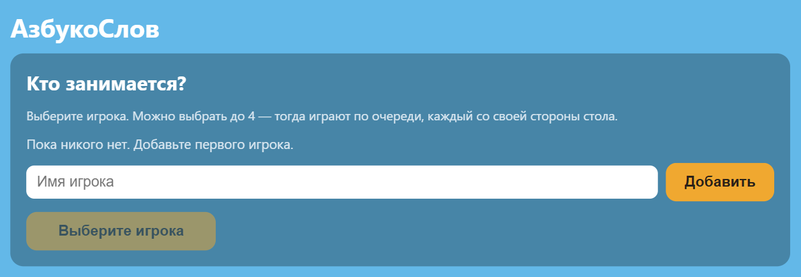

**Зачем нужны игроки.** Программа ведёт статистику по каждому ребёнку отдельно. Без выбранного игрока занятие не начнётся — кнопка внизу так и написана: «Выберите игрока».

**Как добавить.** Наберите имя в поле и нажмите «Добавить».

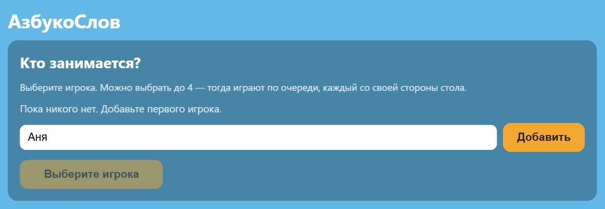

Добавьте столько детей, сколько сядет за стол, — **до четырёх**. Только что добавленный ребёнок сразу отмечен как играющий.

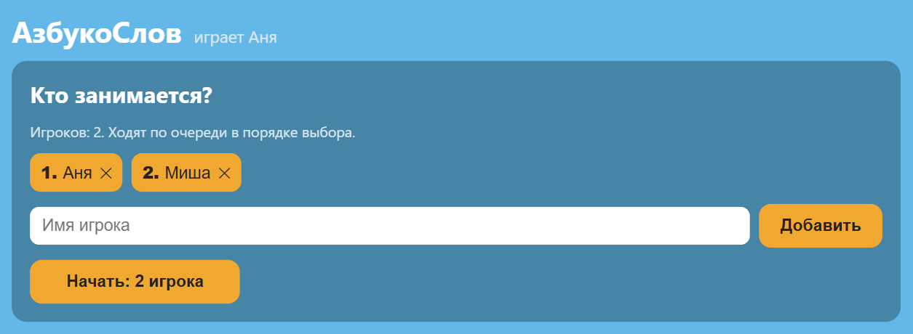

**Нажатие по имени — переключатель:** нажали один раз — ребёнок играет, нажали ещё раз — не играет. Отмеченных может быть от одного до четырёх; если отмечено несколько, они **ходят по очереди**, по кругу.

**Удалить игрока** — крестик справа от имени. Программа спросит подтверждение и скажет, что именно пропадёт: вместе с игроком удаляется его статистика.

Когда все отмечены, нажмите кнопку внизу — она перейдёт в главное меню.

---

## 2. Главное меню

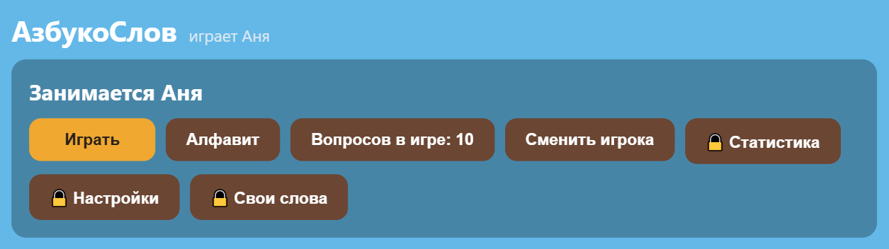

| Кнопка | Что делает |
|---|---|
| **Играть** | Начать занятие: выбор этапа и партия |
| **Алфавит** | Рассмотреть буквы и картинки без игры |
| **Вопросов в игре** | Сколько вопросов достанется каждому ребёнку |
| **Сменить игрока** | Вернуться к списку игроков |
| 🔒 **Статистика** | Успехи по буквам (нужен пароль) |
| 🔒 **Настройки** | Громкость, устройство, цвет экрана, пароль |
| 🔒 **Свои слова** | Свои слова и комплекты |

Замок 🔒 означает, что раздел закрыт паролем педагога — см. [раздел 6](#6-разделы-педагога-и-пароль).

Вверху всегда написано, **кто занимается**. Если там не тот ребёнок, нажмите «Сменить игрока».

---

## 3. Алфавит: рассматриваем буквы

Этот раздел — не игра, а наглядное пособие: здесь ничего не оценивается и в статистику не попадает.

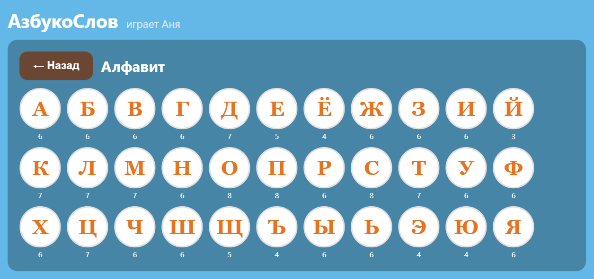

Все 33 буквы сразу. Нажмите любую — откроются её картинки.

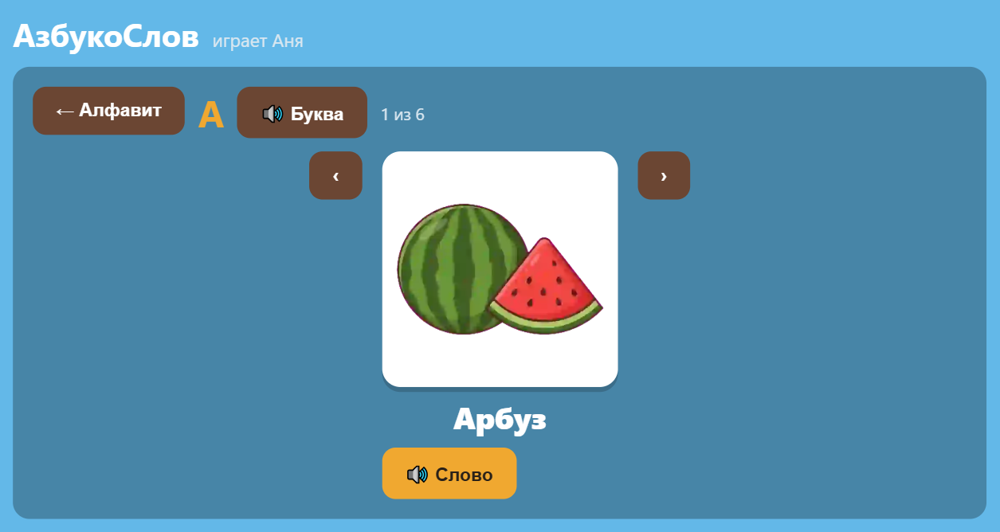

На экране буквы:

- **динамик рядом с буквой** — произнести букву;
- **стрелки влево и вправо** — листать слова на эту букву;
- **динамик под словом** — произнести слово;
- счётчик показывает, какая картинка по счёту и сколько их всего.

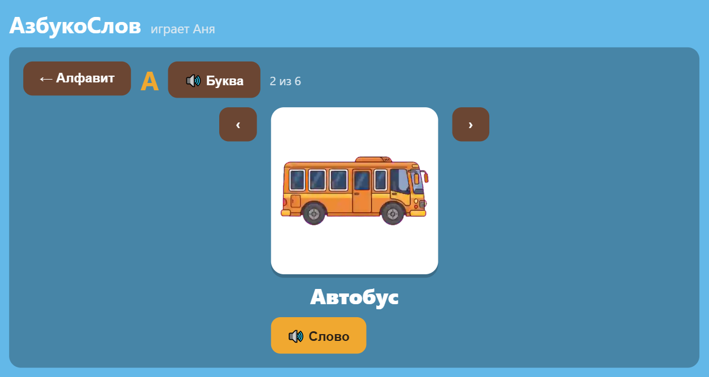

Если буква нарисована серой и не нажимается — на неё в наборе нет слов. В поставочном наборе такого нет: слова есть у всех 33 букв — от трёх (Й) до восьми.

---

## 4. Занятие: три этапа

### Сколько вопросов

Сначала решите, сколько вопросов достанется **каждому** ребёнку.

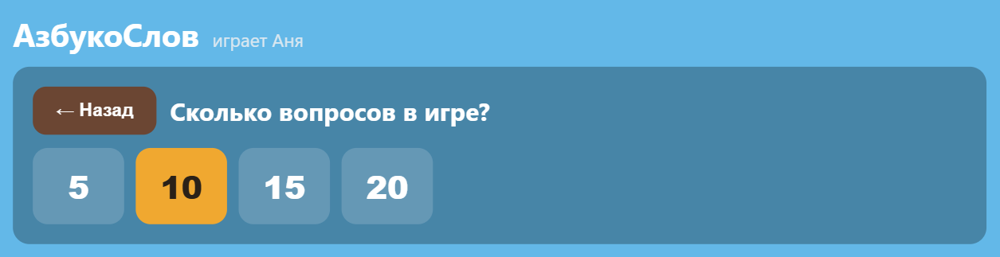

Если играют двое и выбрано 5 — партия будет из десяти ходов: пять у одного, пять у другого.

### Выбор этапа

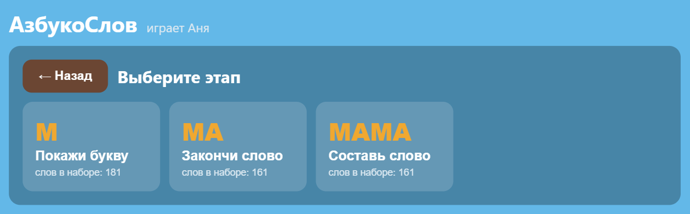

На карточке каждого этапа написано, сколько слов ему подходит. Слов на этапах 2 и 3 меньше: односложные слова годятся только первому этапу — из одного слога нечего собирать.

### Этап 1. Покажи букву

Ребёнок видит картинку и выбирает, с какой буквы начинается слово.

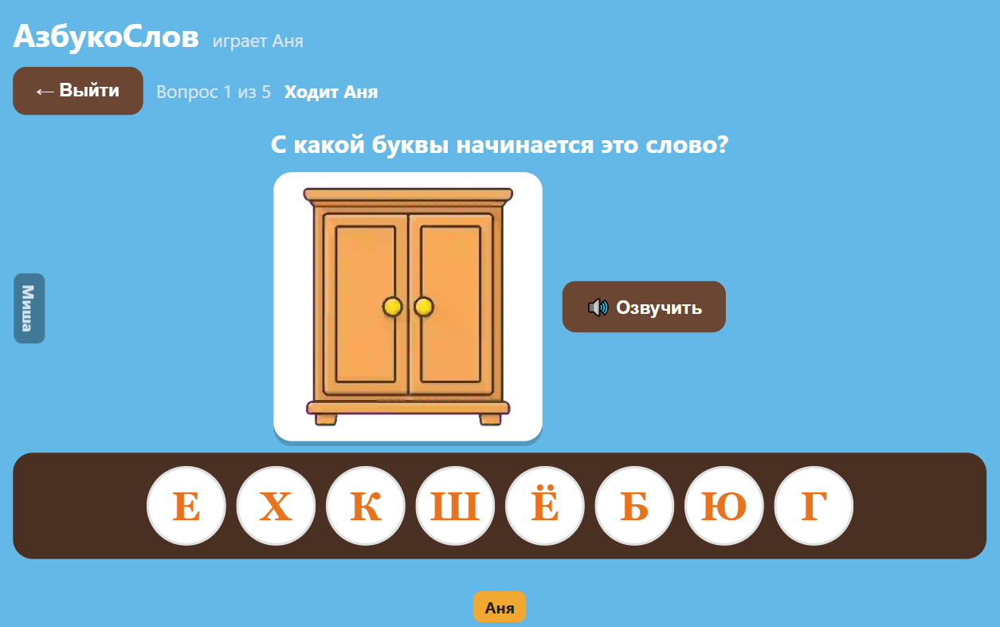

Вариантов всегда восемь, верный ровно один. Кнопка «Озвучить» произносит слово — **она не нажимается сама**, это подсказка, которую даёте вы или ребёнок.

Вверху видно, чей ход и какой вопрос по счёту. По краям экрана — метки игроков: у каждого своя сторона стола.

**Если ребёнок ошибся**, неверная буква краснеет, перечёркивается и уходит с панели. Вопрос **не закрывается** и ход **не переходит** — можно пробовать дальше.

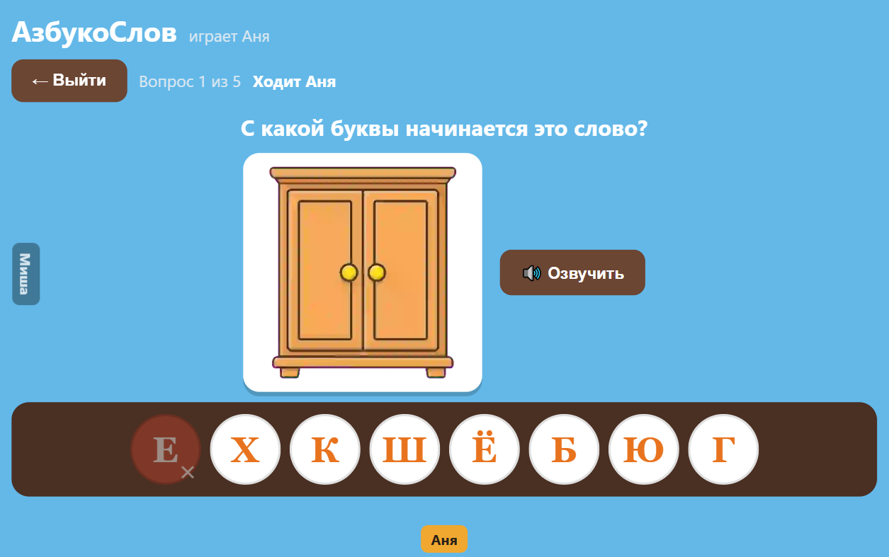

После верного ответа ход переходит следующему ребёнку.

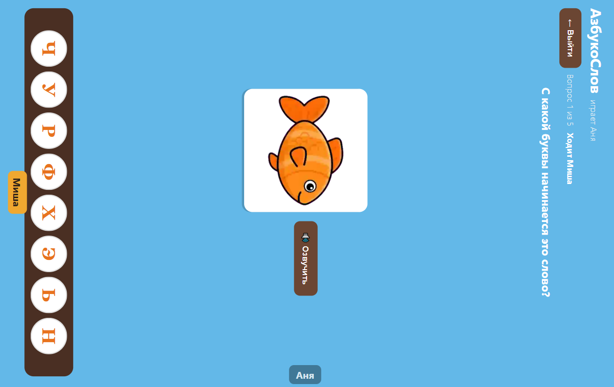

> **В совместной игре дети не получают одно и то же задание.** В пределах круга слова у всех разные, и одному ребёнку одно слово не выпадает двумя его ходами подряд.

### Этап 2. Закончи слово

Показана картинка и начало слова; нужно выбрать последний слог.

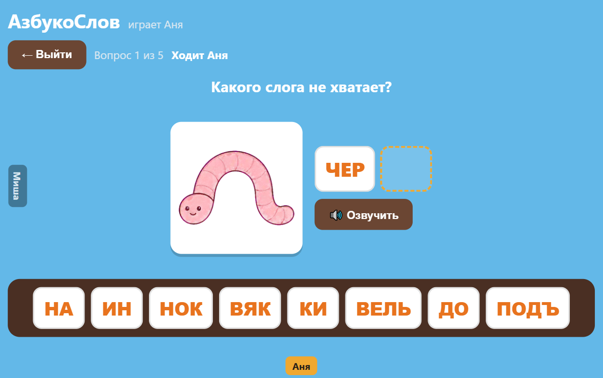

Кнопка «Озвучить» здесь произносит **начало слова, а не слово целиком** — иначе она подсказывала бы ответ.

### Этап 3. Собери слово из слогов

Слово собирается целиком, слог за слогом, слева направо.

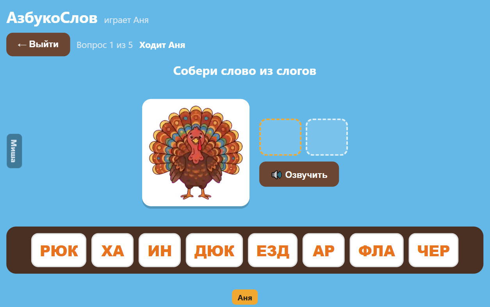

Пустые ячейки наверху — это слоги, которые предстоит поставить. Ошибка убирает вариант, но не сбрасывает уже собранное.

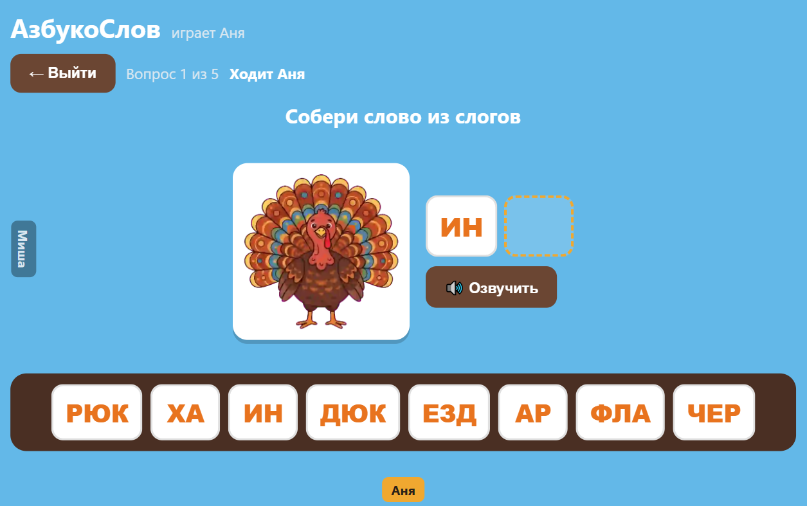

### Выйти посреди партии

Кнопка «Выйти» слева вверху завершает партию досрочно. **Уже данные ответы сохраняются** в статистику — занятие часто прерывают, и терять сделанное из-за этого неправильно.

---

## 5. Итоги партии

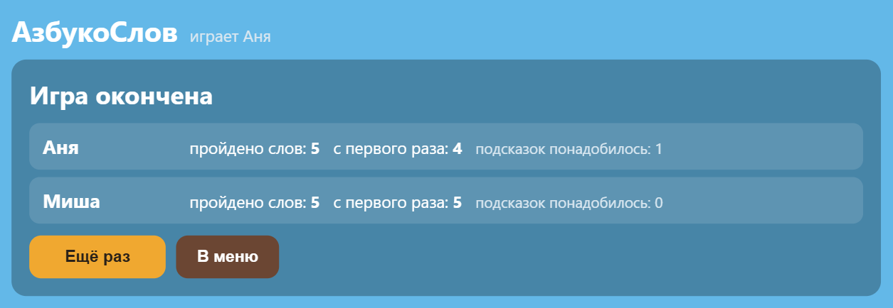

По каждому ребёнку показано:

- **пройдено слов** — сколько вопросов закрыто;
- **с первого раза** — сколько без единой ошибки;
- **подсказок понадобилось** — сколько всего было ошибок.

«Ещё раз» начинает новую партию того же этапа, «В меню» возвращает в главное меню.

---

## 6. Разделы педагога и пароль

Статистика, настройки и свои слова закрыты паролем, чтобы ребёнок не изменил их случайно.

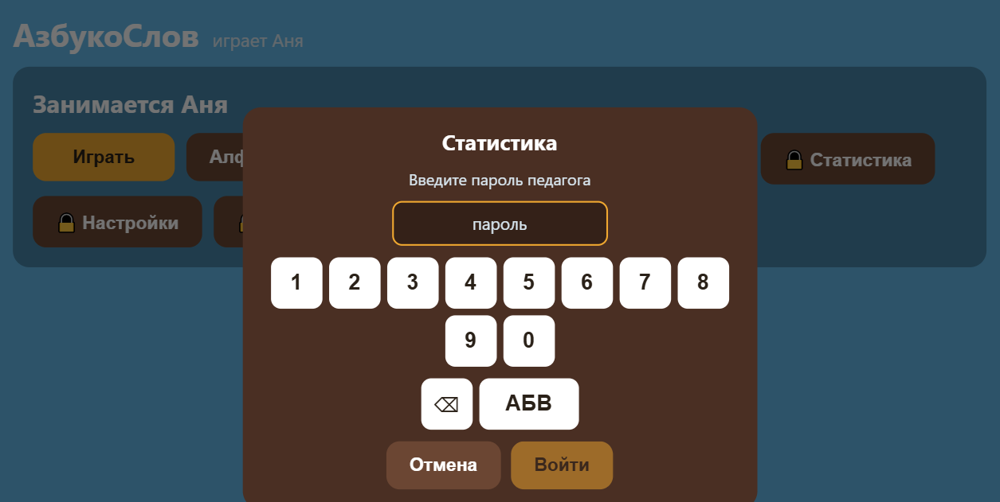

**Пароль по умолчанию — `12345`.** Наберите его и нажмите «Готово».

Кнопка «АБВ» переключает клавиатуру на буквы: пароль может быть и словом. Сменить пароль можно в настройках. **Смените его перед началом работы в группе** — пароль по умолчанию известен всем, у кого есть эта инструкция.

Пароль этого пособия **не совпадает** с паролями других программ комплекта: заданный здесь не откроет соседний виджет.

---

## 7. Статистика

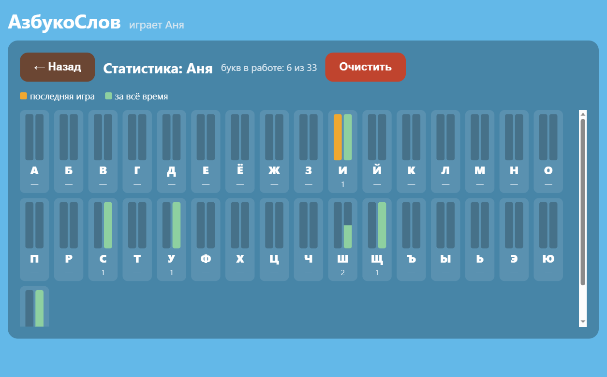

Один столбик на букву, два цвета:

- **оранжевый** — последняя игра;
- **зелёный** — за всё время.

Высота столбика — доля верных ответов. Под буквой стоит число заданных вопросов.

**Буква, по которой ещё не отвечали, показана прочерком, а не нулём.** Ноль читался бы как «отвечал и всё неверно» — ровно наоборот.

Наверху написано, сколько букв в работе: например, «6 из 33».

Кнопка «Очистить» стирает статистику текущего ребёнка. Программа спросит подтверждение и скажет, чьи данные пропадут.

---

## 8. Настройки

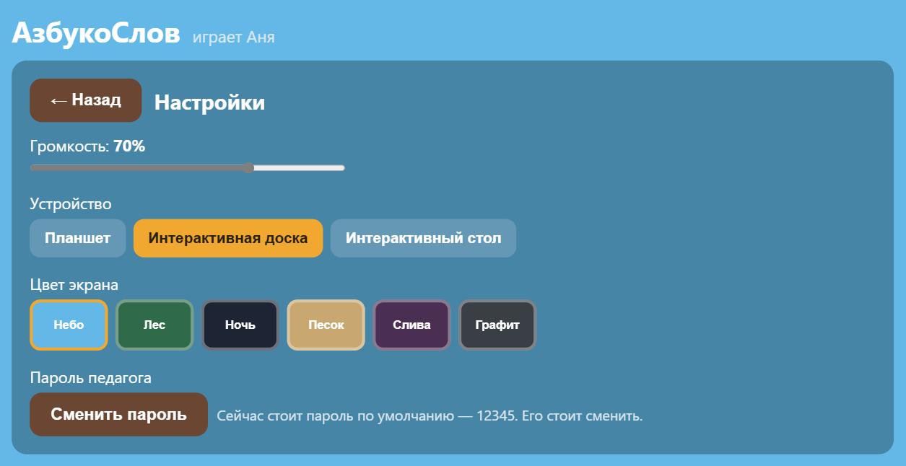

- **Громкость** — общая громкость озвучки.
- **Устройство** — планшет, доска или стол. От этого зависит поведение сцены при игре нескольких детей: на столе сцена **поворачивается** к тому, чей ход, на планшете не вертится, а имя ходящего написано в шапке.
- **Цвет экрана** — шесть вариантов оформления. Тёмные («ночь», «графит») удобны в затемнённом зале, светлые — при ярком свете.
- **Пароль** — сменить пароль педагога. Рядом видно, стоит ли ещё пароль по умолчанию.

---

## 9. Свои слова и комплекты

Раздел позволяет добавить собственные слова и собрать из них комплекты под конкретное занятие.

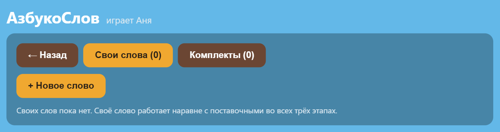

Две вкладки: **слова** и **комплекты**.

### Своё слово

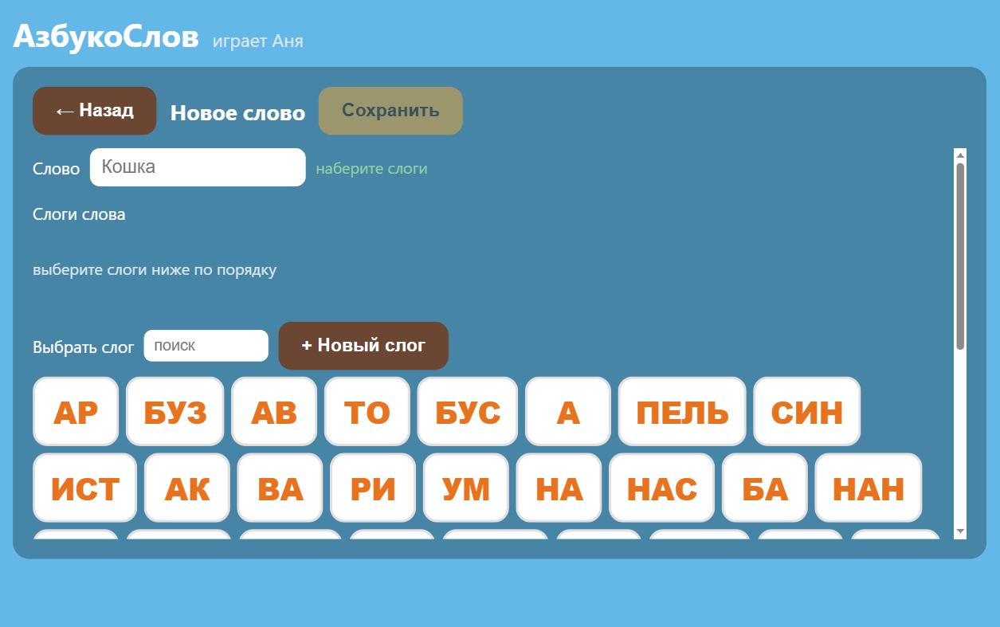

1. Напишите слово русскими буквами, без пробелов и цифр. Первая буква станет заглавной сама.
2. Соберите его **из слогов**, нажимая их внизу по порядку. Нужного слога нет — кнопка «Новый слог» заведёт его.
3. Программа сверяет набранные слоги с написанием: пока они не сходятся, «Сохранить» не сработает.
4. Добавьте картинку и запишите озвучку — без них слово будет числиться неготовым и в игру не попадёт.

Готовность слова показана прямо в списке: программа пишет, чего не хватает, а не просто «не готово».

### Комплекты

Комплект — это набор слов под занятие: в него берутся и поставочные слова, и ваши. С комплектами можно делать пять вещей: создать, переименовать, удалить, **выгрузить в файл** и **загрузить из файла**.

Выгруженный файл переносится на другой компьютер. Вместе со словами едут их слоги, картинки и записи — иначе на новом месте слово оказалось бы сломанным. Поставочные слова не копируются: на принимающем компьютере они берутся из его собственного набора.

После загрузки программа сообщает, сколько слов пришло, и **предупреждает, если комплект приехал не целиком** — например, если на этом компьютере другой набор контента и части слов в нём нет. Лучше узнать об этом сразу, чем на занятии.

---

## 10. Где лежат данные

Игроки, статистика, настройки и ваш контент хранятся в папке

```
C:\ProgramData\kiosk-alphabet
```

Путь всегда написан внизу экрана выбора игрока — на снимках в этом документе строка скрыта.

**Резервная копия** — это копия всей папки. Восстановление — вернуть папку на место при закрытой программе.

Запись устроена так, что прерывание (выключили питание, закрыли крышку) не портит уже сохранённое.

---

## 11. Если что-то пошло не так

| Что видите | Что это значит |
|---|---|
| Кнопка «Выберите игрока» не нажимается | Не отмечен ни один ребёнок — нажмите по имени в списке |
| Буква в алфавите серая | На неё нет слов в текущем наборе |
| «🔇 Озвучка ещё не записана» | У этого слова нет звука. Для своего слова — запишите его в редакторе |
| Этап не открывается | Для него не хватает подходящих слов. Чаще всего так бывает с комплектом из одних односложных слов |
| Картинка не появилась | Сообщите администратору: вероятно, набор контента установлен не полностью |
| Забыт пароль педагога | Сбрасывается администратором — см. инструкцию администратора |

Ошибка всегда показывается **текстом с объяснением** и не приводит к потере уже сохранённого.

---

## Чего в программе нет

Стоит знать заранее, чтобы не искать:

- **автоматического обновления** — новая версия устанавливается администратором;
- **одновременной игры вчетвером**: за столом играют **по очереди**, сцена поворачивается к тому, чей ход;
- **работы через интернет** — программа полностью автономна, и это сделано намеренно.

---

**Дополнительно:** технические подробности (где что лежит, как делать резервную копию, как сбросить пароль) — в «Инструкции администратора» `alphabet-admin-guide.md`.
