# «БиоIQ»: инструкция пользователя

**Для кого.** Для учителя биологии, который проводит викторину в классе, и для всех, кто впервые открыл программу. Специальных знаний не требуется: всё делается кнопками на экране, править файлы настроек не нужно нигде.

**Что это за программа.** Игра-викторина по биологии для интерактивной доски или панели. Вопрос привязан к структуре на изображении: игрок читает вопрос и нажимает на нужную структуру — органеллу клетки, часть растения, внутренний орган. Балл убывает вместе с таймером. Играют по очереди, до трёх человек. Есть редактор: учитель собирает собственную викторину на своих изображениях. Программа работает без интернета.

**Как читать этот документ.** Каждый шаг показан снимком того самого экрана, который вы увидите. Снимки сделаны с работающей программы на демонстрационных игроках «Аня» и «Миша».

---

## Содержание

1. [Стартовый экран](#1-стартовый-экран)
2. [Справочные материалы](#2-справочные-материалы)
3. [Настройка игры](#3-настройка-игры)
4. [Игровое поле](#4-игровое-поле)
5. [Итоги и детализация](#5-итоги-и-детализация)
6. [Режим учителя и пароль](#6-режим-учителя-и-пароль)
7. [Статистика по дням](#7-статистика-по-дням)
8. [Свои викторины](#8-свои-викторины)
9. [Редактор викторины](#9-редактор-викторины)
10. [Обмен викторинами](#10-обмен-викторинами)
11. [Где лежат данные](#11-где-лежат-данные)
12. [Если что-то пошло не так](#12-если-что-то-пошло-не-так)

---

## 1. Стартовый экран

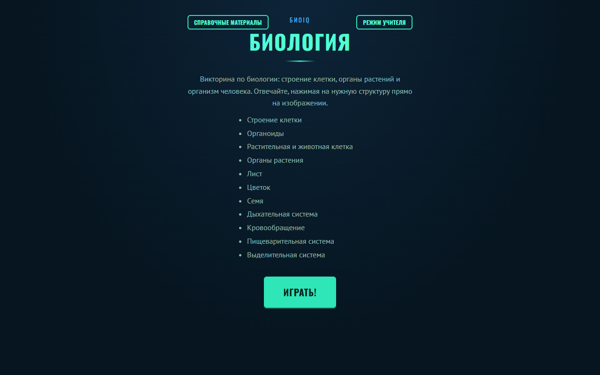

Программа открывается на описании встроенной викторины: по чему она, какие в ней темы и как отвечать.

Три кнопки ведут дальше:

- **«Играть!»** — начать викторину;
- **«Справочные материалы»** — тематические изображения по биологии;
- **«Режим учителя»** — редактор викторин и статистика, закрыт паролем.

---

## 2. Справочные материалы

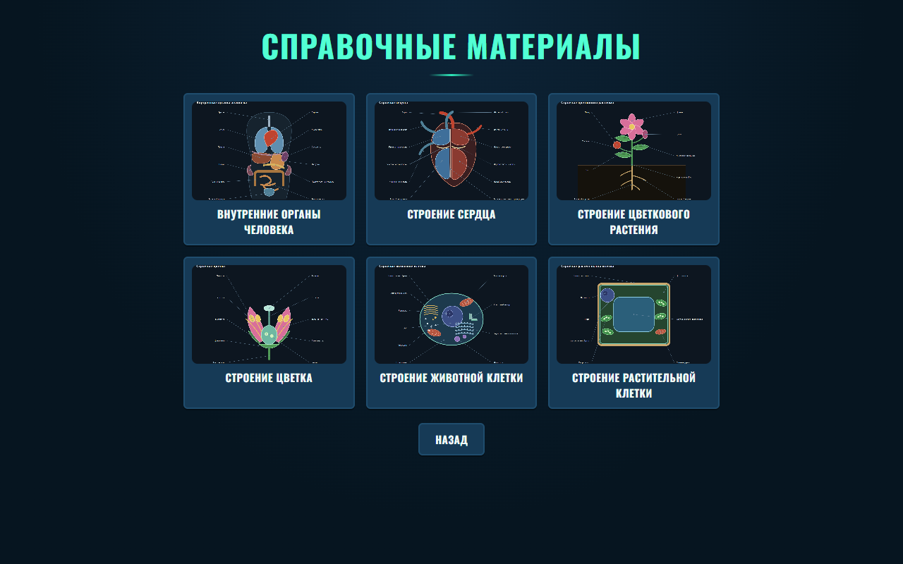

Шесть тематических изображений по трём темам — **внутренние органы, растения, клетки**, по два на каждую.

Раздел **не спрятан за пароль**: это учебный материал продукта, а не инструмент редактирования. Его можно открыть на уроке и до игры, и вместо неё.

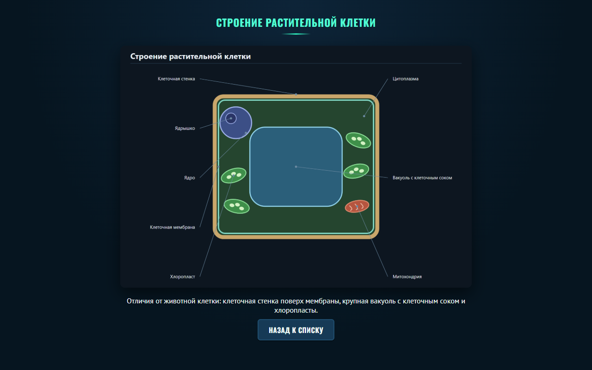

На справочном изображении структуры **подписаны** — в отличие от игрового поля, где подписей нет намеренно, иначе ответ был бы написан прямо на картинке.

---

## 3. Настройка игры


**Сколько игроков** — от одного до трёх. Двое и трое играют по очереди на одном экране.

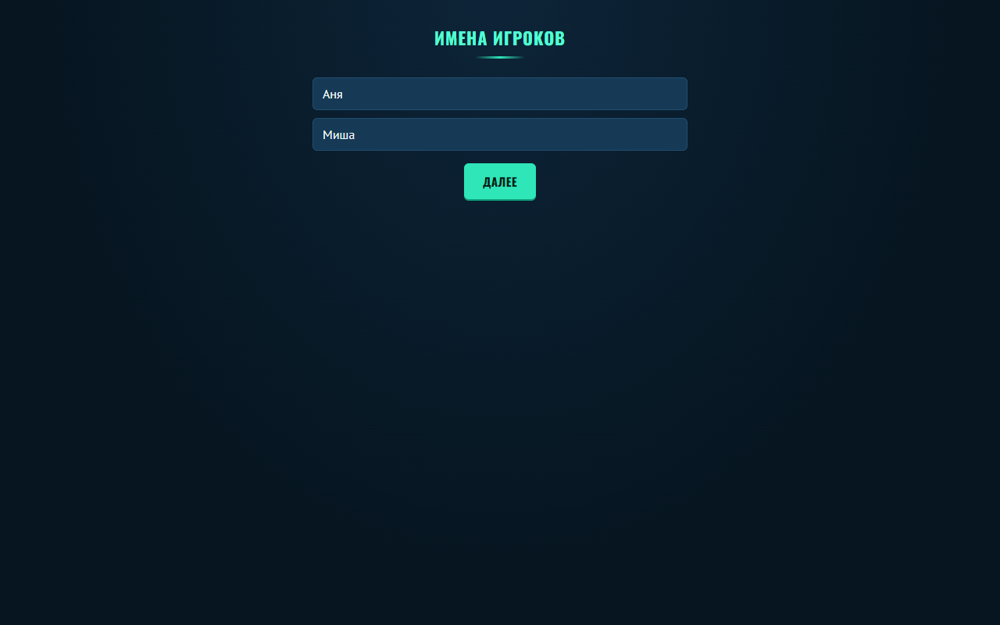

**Имена** нужны, чтобы результаты в статистике были подписаны. Без имени игру не начать.


**Уровень сложности** — три, и у каждого **свой набор вопросов и своё изображение**:

| Уровень | Изображение | Вопросов |
|---|---|--:|
| Начинающий | Строение клетки | 36 |
| Опытный | Строение растений | 44 |
| Профессионал | Организм человека | 40 |

Ни один вопрос не повторяется на двух уровнях: пройденный «Начинающий» не подскажет ответы на «Профессионале».

Чем выше уровень, тем дороже вопрос и меньше времени: 35 секунд на первом, 30 на втором, 25 на третьем.

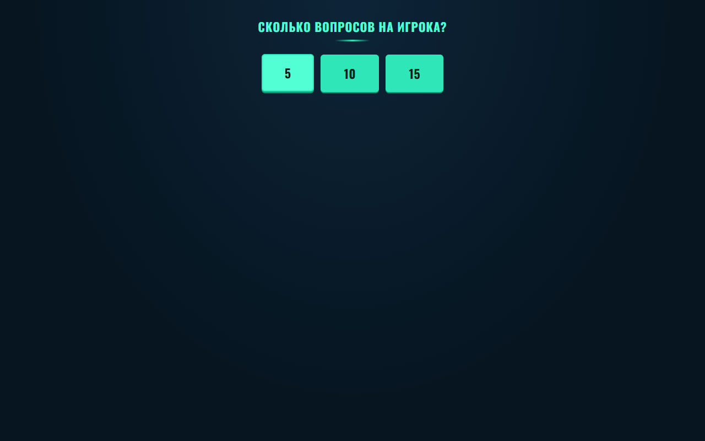

**Сколько вопросов достанется каждому игроку.** При двух игроках и пяти вопросах партия — десять ходов.

---

## 4. Игровое поле

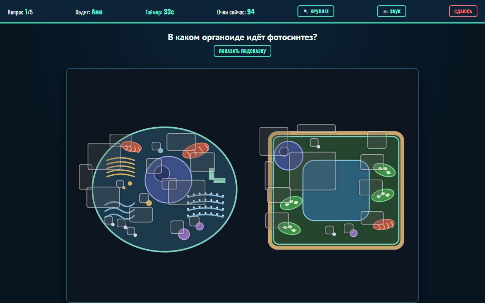

Вверху — строка хода: какой это вопрос, чей ход, сколько осталось времени и **сколько очков даст ответ прямо сейчас**. Это число убывает вместе с таймером: ответил быстро — получил больше.

Под вопросом — изображение уровня. Светлыми рамками отмечено то, по чему **можно нажать**. Правильная структура — одна; остальные рамки либо структуры других вопросов, либо точки-обманки.

**«Показать подсказку»** — подсказка к текущему вопросу.

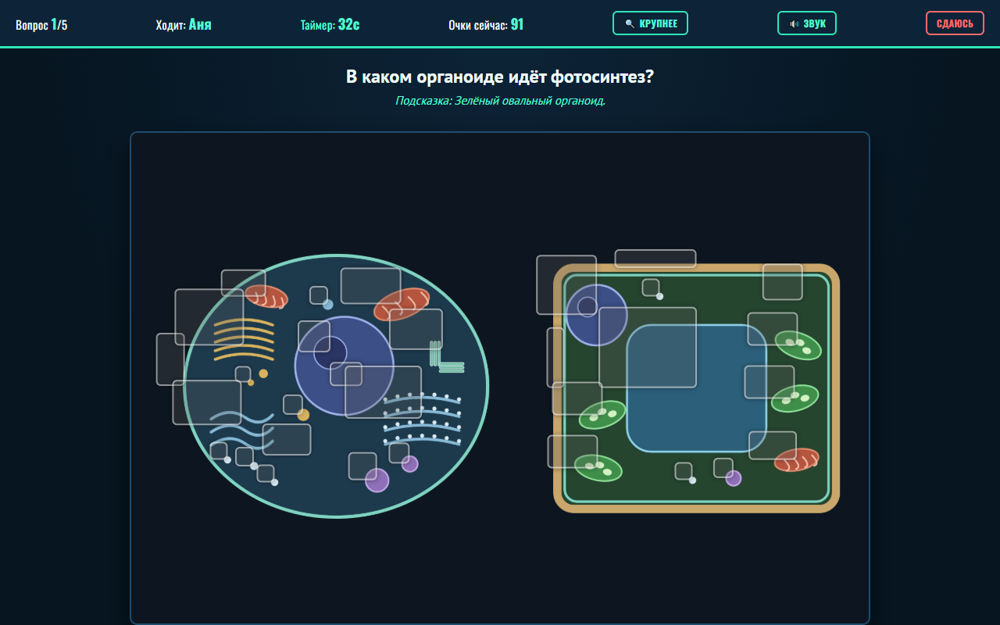

Подсказка есть у каждого вопроса встроенной викторины. Она описывает структуру словами, не называя её.

Штрафа за подсказку нет, но **время на неё уходит**, а очки убывают вместе с таймером: прочитал подсказку — ответил дешевле.

**«Крупнее»** увеличивает изображение, если структуры мелковаты для доски. Выбор запоминается между партиями.

**«Сдаюсь»** заканчивает партию досрочно.

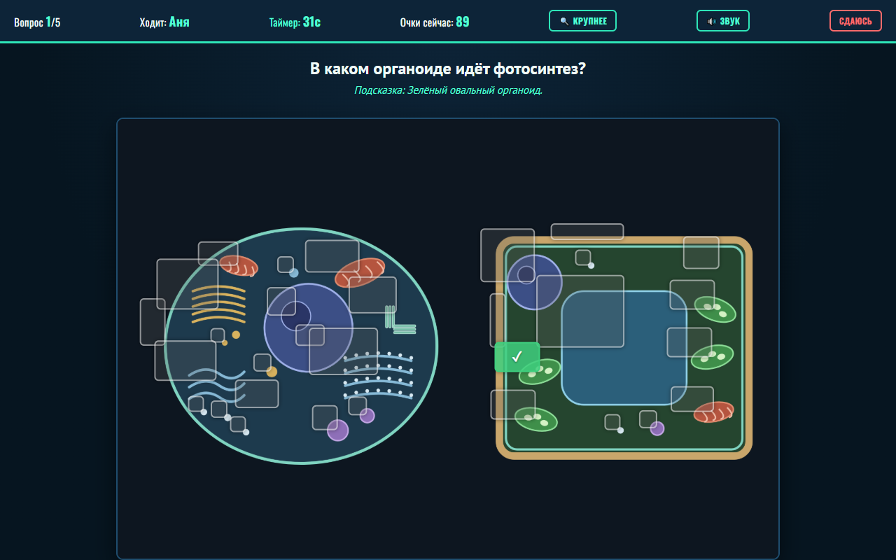

**Верно** — структура отмечается зелёной галочкой, очки начисляются.

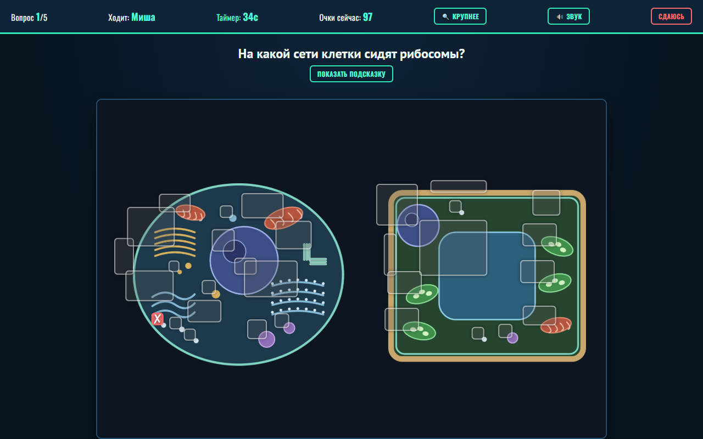

**Неверно** — нажатая структура отмечается красным, ход переходит следующему игроку.

---

## 5. Итоги и детализация

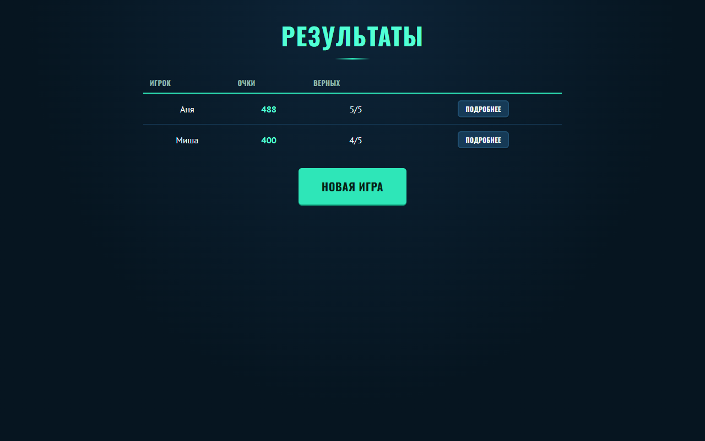

В конце — таблица по всем игрокам: очки и сколько ответов из скольких верны.

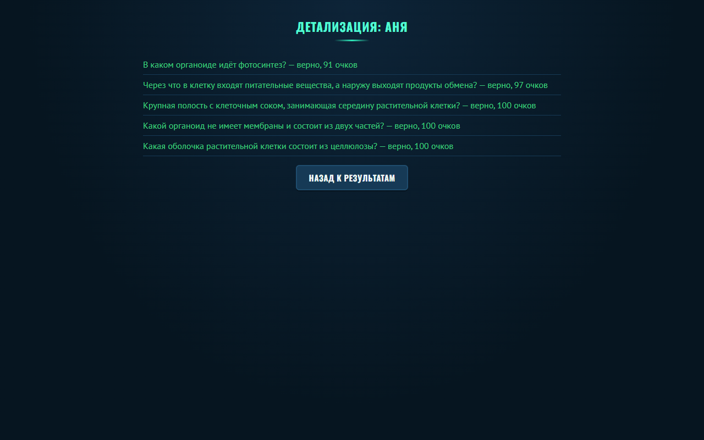

**«Подробнее»** показывает партию по вопросам: что спрашивали, верно ответил игрок или нет и сколько очков принёс каждый ответ.

---

## 6. Режим учителя и пароль

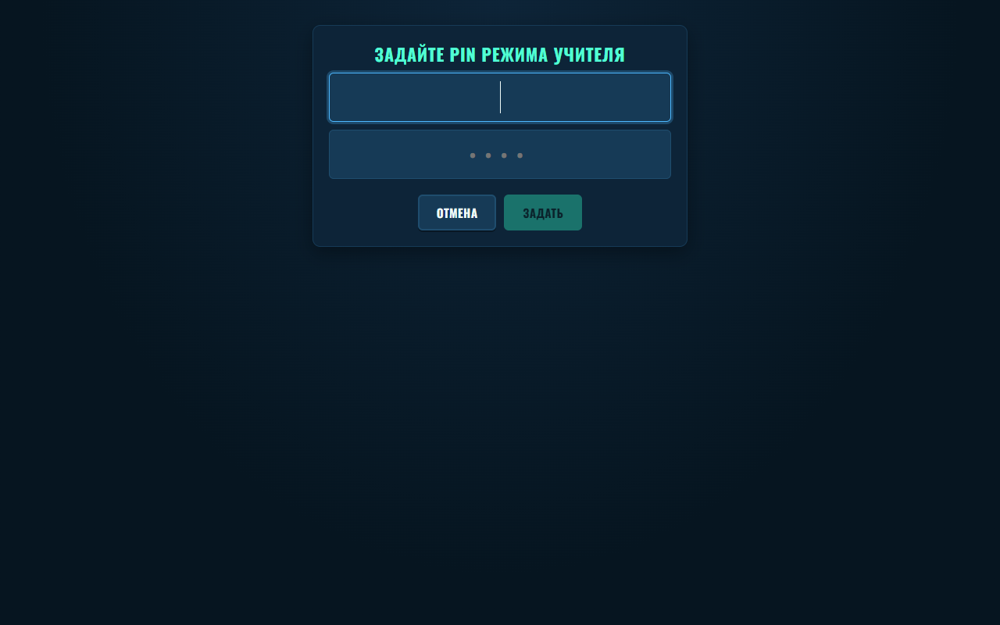

При первом входе PIN **задаётся здесь же** — программа просит придумать его и повторить. Дальше он спрашивается при каждом входе.

PIN защищает не содержание урока, а **правку викторин**: чтобы ребёнок не изменил вопросы и не удалил чужую работу.

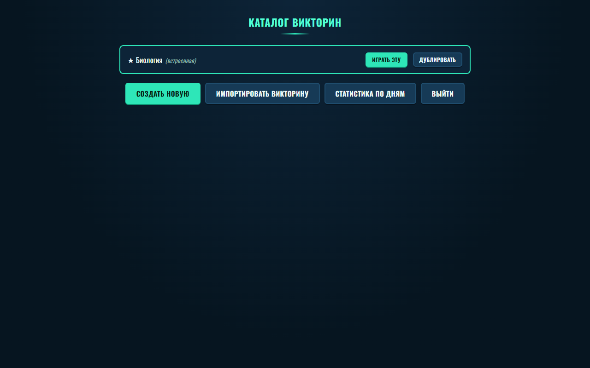

Каталог показывает встроенную методическую викторину (со звёздочкой) и все созданные учителем.

---

## 7. Статистика по дням

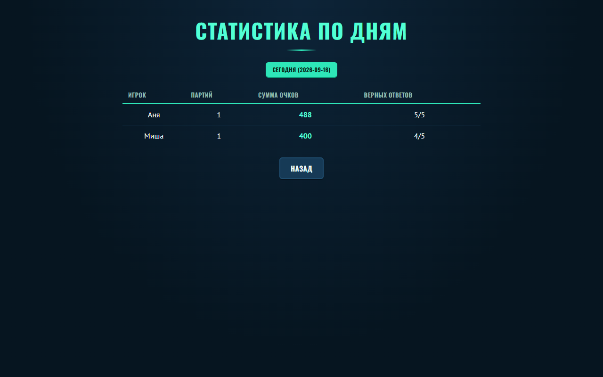

Сводка **по всем участникам сразу**: сколько партий сыграл каждый, сумма очков и сколько ответов верны.

Кнопка вверху переключает на **сегодняшний день** — отдельная сводка за одну дату, чтобы посмотреть результаты только что прошедшего урока, не смешивая их с прошлыми.

---

## 8. Свои викторины

Встроенную викторину **изменить нельзя** — она поставляется с продуктом. Но её можно взять за основу.

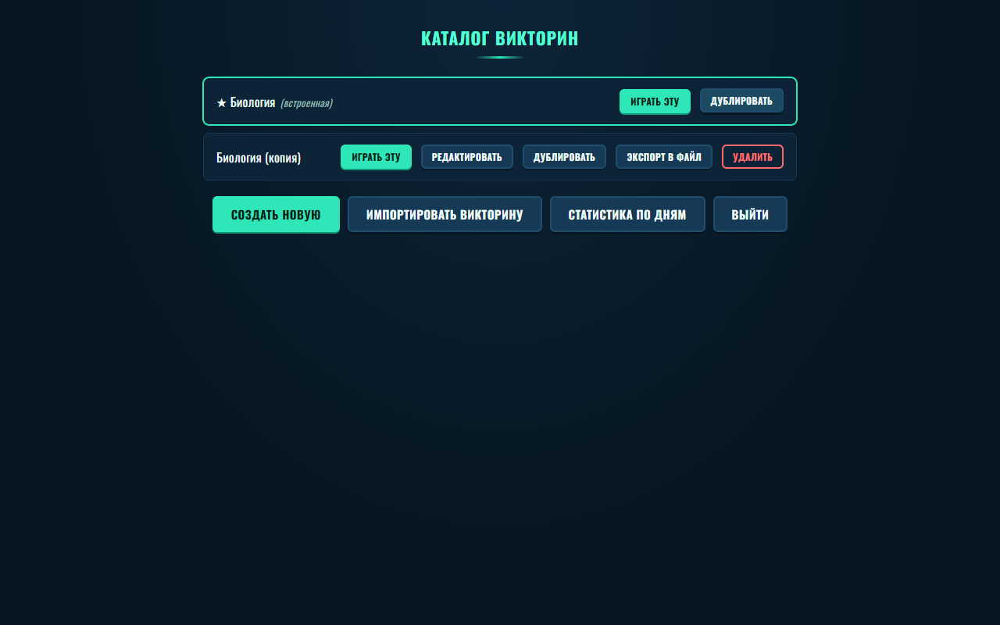

**«Дублировать»** делает полную копию со всеми изображениями и вопросами — дальше её правят как свою. Это самый короткий путь к собственной викторине: не нужно искать изображения и расставлять точки с нуля.

**«Создать новую»** начинает с пустой викторины и своего изображения.

---

## 9. Редактор викторины

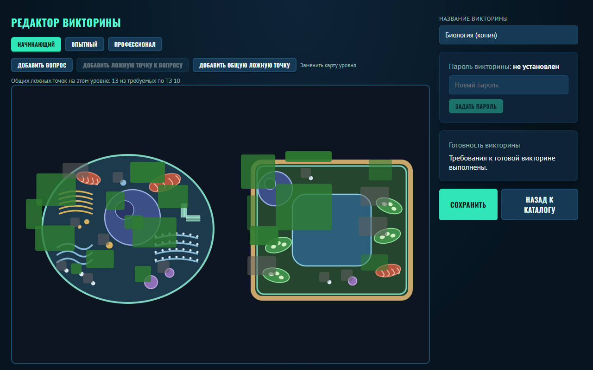

Слева — изображение уровня с расставленными областями, справа — свойства.

**Вкладки уровней** вверху: у каждого уровня своё изображение и свои вопросы. Канвас показывает только текущий уровень.

**«Добавить вопрос»** — нажмите кнопку, затем место на изображении. Появится область, и справа откроется форма: текст вопроса, ответ, подсказка, вес (сколько очков), время и тема. В текст можно вставлять спецсимволы — от индексов формул (CO₂, H₂O) до знаков пола ♀ ♂ и знака скрещивания ×. К вопросу, ответу и подсказке можно добавить своё изображение.

**«Добавить ложную точку к вопросу»** — обманка, относящаяся к одному конкретному вопросу.

**«Добавить общую ложную точку»** — обманка для всего уровня. Под кнопками написано, сколько их сейчас и сколько требуется: **не меньше десяти на уровень**.

**«Готовность викторины»** справа перечисляет, чего не хватает до готовой викторины, **поимённо**. Сохранять при этом не запрещено: собрать викторину за один присест невозможно, и запрет означал бы «не сохраняйся, пока не закончишь».

**«Задать пароль»** закрывает конкретную викторину от изменений отдельно от общего PIN.

> **Области не должны налезать друг на друга.** Две наложенные области — это кнопка поверх кнопки: клик достанется верхней, и верный ответ не засчитается. Проверка готовности называет такие пары поимённо.

---

## 10. Обмен викторинами

**«Экспорт в файл»** в каталоге сохраняет викторину одним файлом `.bioiq.json` — его можно переслать коллеге.

**«Импортировать викторину»** принимает такой файл обратно.

Расширение у файла своё, не общее с «ХимIQ»: викторины по биологии и по химии не взаимозаменяемы, и открытие одной вместо другой выглядело бы как порча данных.

---

## 11. Где лежат данные

Викторины учителя, история партий и PIN лежат в профиле пользователя Windows:

```
%APPDATA%\kiosk-bioiq
```

то есть обычно `C:\Users\<имя>\AppData\Roaming\kiosk-bioiq`. Внутри: `userdata.json` — история и настройки, папка `quizzes` — викторины вместе с изображениями.

> Это **профиль пользователя**, а не общий каталог. Если за компьютером работают под разными учётными записями Windows, викторины одного учителя не будут видны другому. Чтобы передать их, воспользуйтесь экспортом в файл (раздел 10).

---

## 12. Если что-то пошло не так

**Забыли PIN режима учителя.** Программа его не показывает и не восстанавливает — это пароль. Сбросить можно, удалив `userdata.json` из каталога данных, но **вместе с ним пропадёт вся статистика**; созданные викторины в папке `quizzes` при этом уцелеют.

**Нажимаю на структуру, а ответ не засчитывается.** Проверьте, попадаете ли вы в светлую рамку — нажимать нужно в неё, а не рядом. Если структуры мелкие, включите «Крупнее».

**В своей викторине правильный ответ не срабатывает.** Скорее всего, области налезли друг на друга: сверху оказалась чужая, и клик достаётся ей. Откройте викторину в редакторе и посмотрите панель «Готовность викторины» — она назовёт налезающие области по именам.

**Пропала статистика.** Проверьте, под той ли учётной записью Windows вы вошли: данные лежат в профиле пользователя (раздел 11).

**Не открывается изображение уровня в своей викторине.** Изображение копируется в каталог викторины при добавлении. Если исходный файл потом удалили или переименовали, викторине это не мешает; а вот если папку `quizzes` перенесли частично, изображение могло остаться на старом месте.

---

## Чего в программе нет

- **Интернета.** Приложение работает полностью автономно и ничего никуда не отправляет.
- **Автоматического обновления.** Новая версия ставится поверх установщиком.
- **Соревнования больше трёх игроков.** По ТЗ — двое и трое одновременно.
