# «ХимIQ»: инструкция пользователя

**Для кого.** Для педагога, который проводит занятие, и для всех, кто впервые открыл программу. Специальных знаний не требуется: всё делается кнопками на экране, править файлы настроек не нужно нигде.

**Что это за программа.** Викторина по химии для 1–3 игроков по очереди: на экране картинка с клетками-ответами, нужно кликнуть по клетке с правильным ответом на заданный вопрос — чем быстрее, тем больше очков. Есть три уровня сложности и встроенный редактор, чтобы педагог мог составить свою викторину. Программа работает без интернета: весь контент лежит на компьютере.

**Как читать этот документ.** Каждый шаг показан снимком того самого экрана, который вы увидите. Снимки сделаны с работающей программы на демонстрационном прогоне.

---

## Содержание

1. [Главный экран](#1-главный-экран)
2. [Справочные материалы](#2-справочные-материалы)
3. [Начало партии](#3-начало-партии)
4. [Игра](#4-игра)
5. [Результаты](#5-результаты)
6. [Режим учителя и PIN](#6-режим-учителя-и-pin)
7. [Каталог викторин](#7-каталог-викторин)
8. [Статистика по дням](#8-статистика-по-дням)
9. [Своя викторина: коротко](#9-своя-викторина-коротко)
10. [Если что-то пошло не так](#10-если-что-то-пошло-не-так)

---

## 1. Главный экран

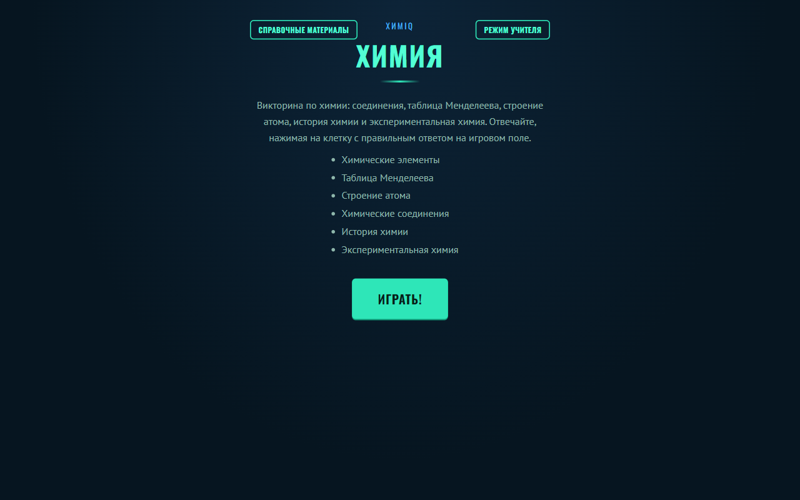

Вверху — две кнопки: **«Справочные материалы»** (открыты всем без пароля) и **«Режим учителя»** (требует PIN, см. [раздел 6](#6-режим-учителя-и-pin)). По центру — название и темы встроенной викторины. Внизу — кнопка **«Играть!»**, с неё начинается партия.

---

## 2. Справочные материалы

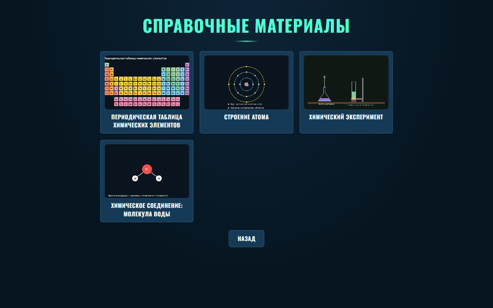

Четыре тематических изображения: периодическая таблица, строение атома, лабораторный эксперимент, молекула воды. Нажмите на любое, чтобы рассмотреть крупнее и прочитать подпись.

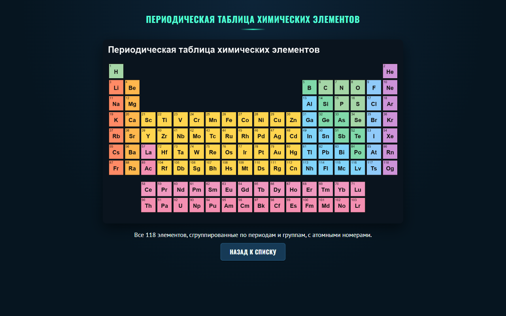

**Пароль не нужен** — это методический материал для показа на занятии, а не инструмент редактирования. «Назад к списку» возвращает к сетке изображений, «Назад» — на главный экран.

---

## 3. Начало партии

Нажмите «Играть!» на главном экране.

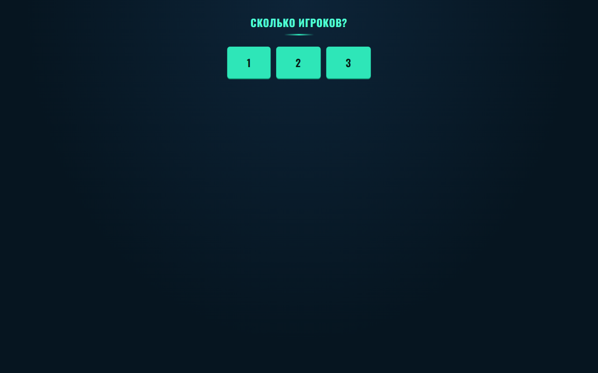

**Шаг 1 — число игроков.** От 1 до 3. Дальше программа попросит ввести имя каждого — пустое имя дальше не пропустит.

**Шаг 2 — уровень сложности.**

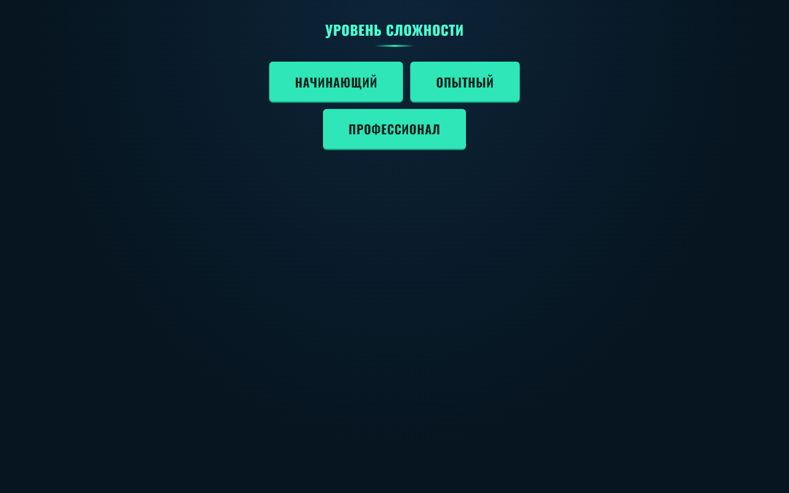

«Начинающий» / «Опытный» / «Профессионал» — у каждого своё игровое поле и свой набор вопросов.

**Шаг 3 — сколько вопросов на игрока.**

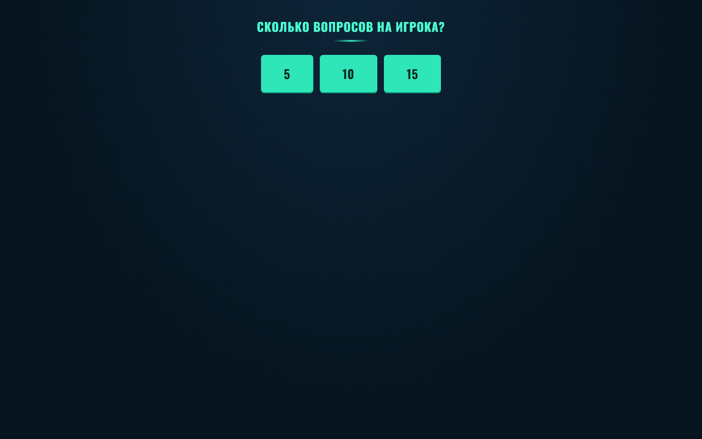

5, 10 или 15 — сколько вопросов достанется каждому. Если в выбранной викторине вопросов на всех не хватает, лишние варианты не предлагаются.

---

## 4. Игра

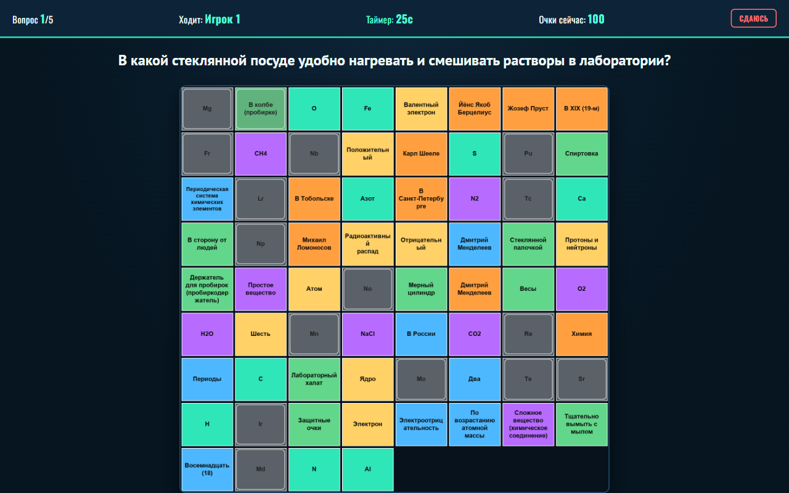

Сверху — номер вопроса, чей ход, оставшееся время и текущие очки за вопрос. Сам вопрос — прямо над полем. Кликните клетку, в которой, по-вашему, правильный ответ.

- **Очки убывают со временем** — чем быстрее ответили, тем больше получите за верный ответ.
- **Неверный клик** окрашивает клетку красным и засчитывает 0 очков за вопрос — ход переходит следующему игроку.
- **«Сдаюсь»** пропускает вопрос без клика, тоже 0 очков.
- Если у вопроса есть подсказка, кнопка «Показать подсказку» откроет её текст (сама подсказка заранее не видна).
- Не ответили до конца таймера — вопрос засчитывается как неверный автоматически, партия не виснет.

При 2–3 игроках ход переходит по кругу — «Ходит: …» вверху всегда показывает, чья сейчас очередь.

---

## 5. Результаты

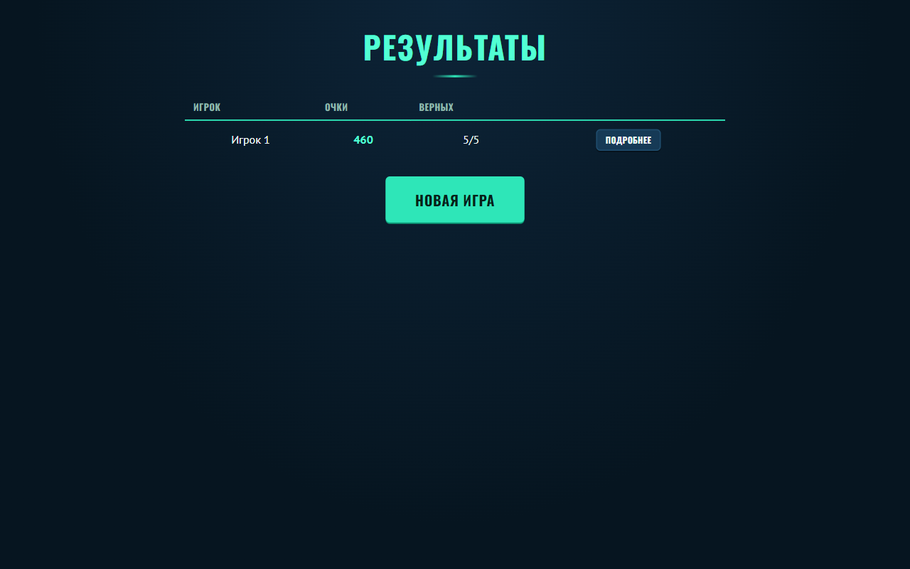

Таблица по каждому игроку: набранные очки и сколько ответов из всех — верные. Кнопка «Подробнее» у любого игрока открывает разбор вопрос за вопросом:

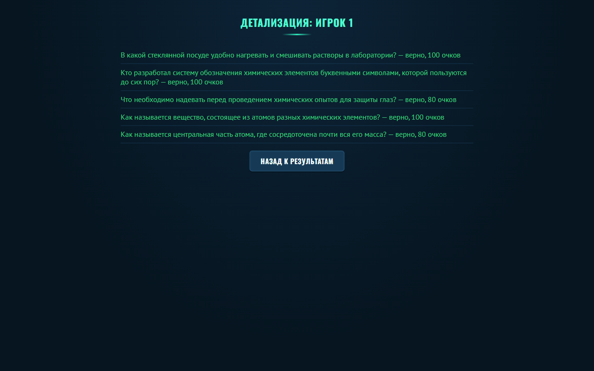

«Новая игра» возвращает к началу — можно тут же сыграть ещё раз с новыми настройками.

---

## 6. Режим учителя и PIN

Кнопка «Режим учителя» на главном экране открывает каталог викторин, редактор и статистику. При первом обращении программа попросит **задать** PIN самостоятельно:

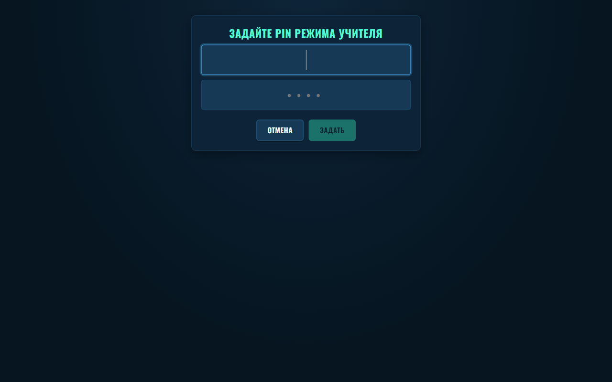

Ровно 4 цифры, ввести дважды для подтверждения — если два ввода разойдутся, программа попросит повторить, а не молча возьмёт первый вариант. При следующих входах программа спросит уже заданный PIN один раз.

**Если PIN забыт** — обратитесь к администратору устройства: восстановление PIN требует удаления файла с данными (подробнее — `chimiq-admin-guide.md`), а это стирает и накопленную статистику, поэтому сброс — не то, что стоит делать самостоятельно без крайней необходимости.

---

## 7. Каталог викторин

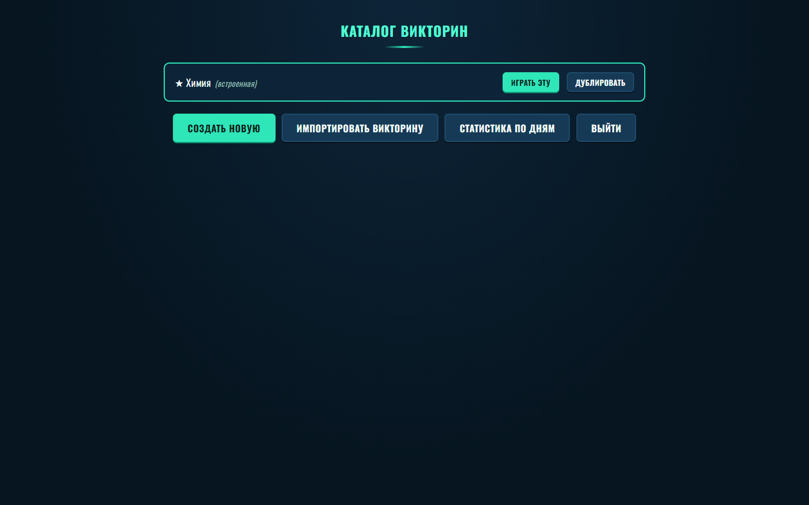

Встроенная викторина «Химия» отмечена звёздочкой — её саму менять нельзя, но можно «Дублировать» и отредактировать копию под себя. У своих викторин доступны: играть, редактировать, дублировать, экспортировать в файл, удалить. Если викторине задан пароль, каждое из последних четырёх действий сначала его спросит.

«Создать новую» открывает мастер создания с нуля (название + картинка первого уровня). «Импортировать викторину» принимает файл `.chimiq.json`, которым поделился коллега с другого устройства с той же программой — все картинки внутри файла, отдельно копировать их не нужно.

---

## 8. Статистика по дням

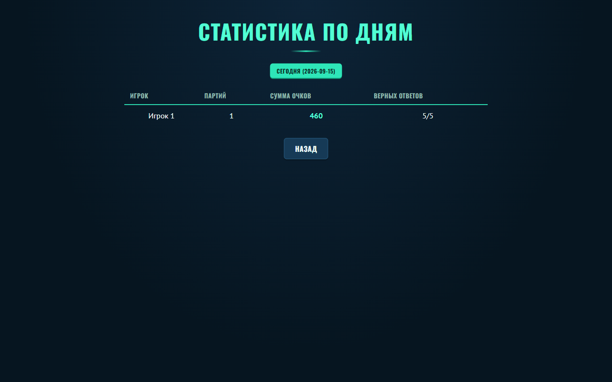

Кнопки сверху — даты, за которые сыграна хотя бы одна партия; выбранная подсвечена. Ниже — таблица: игрок, число партий за этот день, сумма очков, сумма верных ответов. Если партий ещё не было — программа честно скажет «Ещё не сыграно ни одной партии», а не покажет пустую таблицу.

---

## 9. Своя викторина: коротко

Откройте «Создать новую» или «Редактировать» уже существующую. Экран редактора показывает картинку выбранного уровня (у викторины их три — по вкладке на уровень) — кликните по картинке, чтобы поставить новую точку-ответ. Откроется форма: текст вопроса, текст ответа, вес (влияет на очки), тема, время на ответ, необязательная подсказка. Для химических формул есть панель спецсимволов (подстрочные/надстрочные цифры, ⁺⁻, →).

Отдельно от вопросов можно добавить точки-«приманки» — клетки без своего вопроса, они просто заполняют поле и не выдают ответ заранее. Программа не даст сохранить викторину, если у какого-то из трёх уровней нет картинки.

Пароль на викторину задаётся при её создании/редактировании — он не связан с общим PIN режима учителя и защищает именно эту викторину от чужого редактирования, удаления, дублирования и экспорта.

---

## 10. Если что-то пошло не так

- **На главном экране появилась строка «Не удалось прочитать сохранённые данные ХимIQ…».** Файл с историей партий повреждён (сбой диска, антивирус) — программа не падает, играть и сохранять новые партии можно сразу, предупреждение больше не появится после первого же сохранения. Старая статистика в этом случае, к сожалению, потеряна — если она важна, обратитесь к администратору по поводу резервных копий.
- **PIN учителя не подходит.** Убедитесь, что вводите те же 4 цифры, что задавали при первом входе — при опечатке в подтверждении программа сама просит повторить, значит сохранённый PIN совпадает с тем, что вы ввели дважды одинаково.
- **Не удаётся сохранить свою викторину.** Проверьте, что картинка загружена для всех трёх уровней сложности, а не только для того, который вы сейчас редактируете.
- **Не хватает вариантов «сколько вопросов на игрока».** В викторине недостаточно вопросов выбранного уровня для стольких игроков — либо возьмите меньше вопросов из предложенных, либо выберите другой уровень/другую викторину.
