# «Инофон»: руководство пользователя

Пособие для изучения слов на шести языках: русском, английском, французском, немецком, китайском и башкирском. Рассчитано на интерактивную доску или панель в классе, работает без интернета.

---

## С чего начать

Откройте приложение — появится экран **«Кто занимается»**.

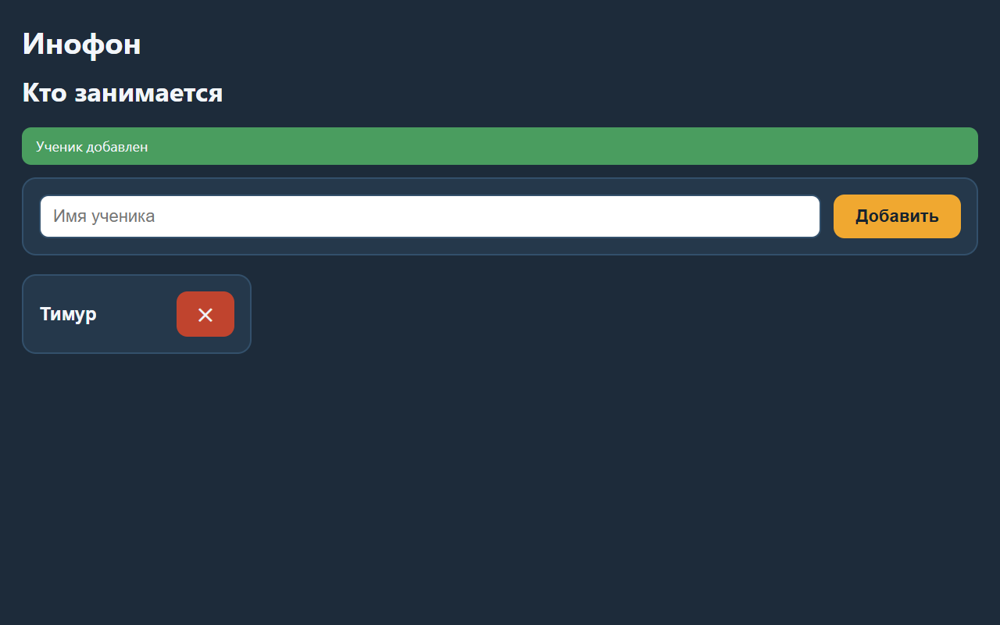

Наберите имя ученика и нажмите **«Добавить»**. Ученик нужен для того, чтобы приложение запоминало его результаты отдельно от других. Добавьте столько, сколько детей занимается — до четырёх могут играть одновременно.

Нажмите на имя, чтобы начать занятие. Сменить ученика можно в любой момент кнопкой **«← Назад»**.

> Удаление ученика убирает и все его результаты. Это сделано намеренно: иначе новый ученик с тем же именем однажды получил бы чужие оценки.

---

## Выбор темы и сцены

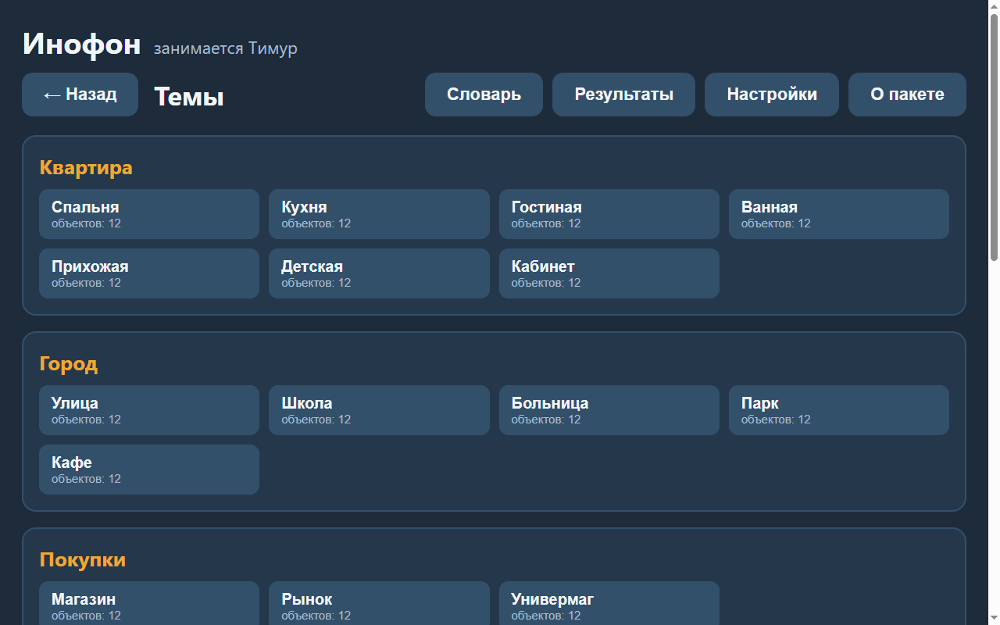

Темы раскрыты списком, под каждой — её сцены. У каждой сцены написано, сколько на ней объектов.

Всего восемь тем: **Квартира, Город, Покупки, Человек, Путешествие, Природа, Занятия, Праздник**.

Нажмите на сцену, чтобы перейти к настройке занятия.

---

## Настройка занятия

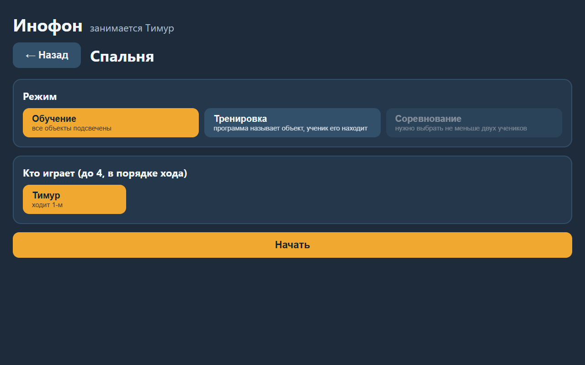

Здесь выбирается всё, что нужно до начала:

**Режим.** Три варианта — «Обучение», «Тренировка», «Соревнование». Под каждым написано, чем он отличается.

**Кто играет.** Отметьте учеников в том порядке, в каком они ходят. Под каждым отмеченным написано, каким он ходит. Больше четырёх выбрать нельзя.

**Вопросов каждому.** 5, 10, 15 или 20. В обучении этого выбора нет — там партии не бывает.

**Как задавать объект.** Программа может произносить слово, показывать его написание или делать то и другое. Выключить оба нельзя: ученику будет нечего искать.

> Если выбран один ученик, «Соревнование» будет погашено — оно требует не меньше двух. Причина написана прямо под названием режима.

---

## Режим «Обучение»

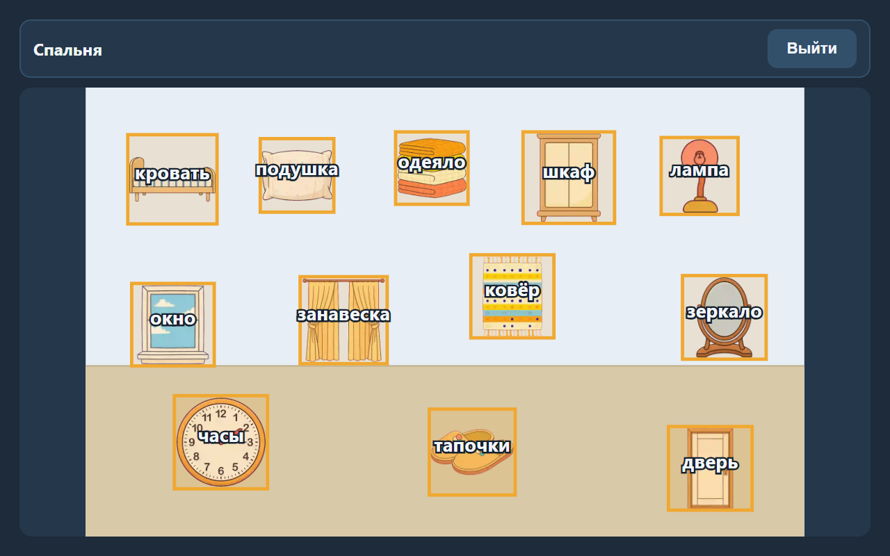

Все объекты подсвечены и подписаны на родном языке. Здесь нет ни счёта, ни очерёдности — ученик просто разглядывает сцену и щёлкает по тому, что интересно.

Щелчок открывает **карточку объекта**:

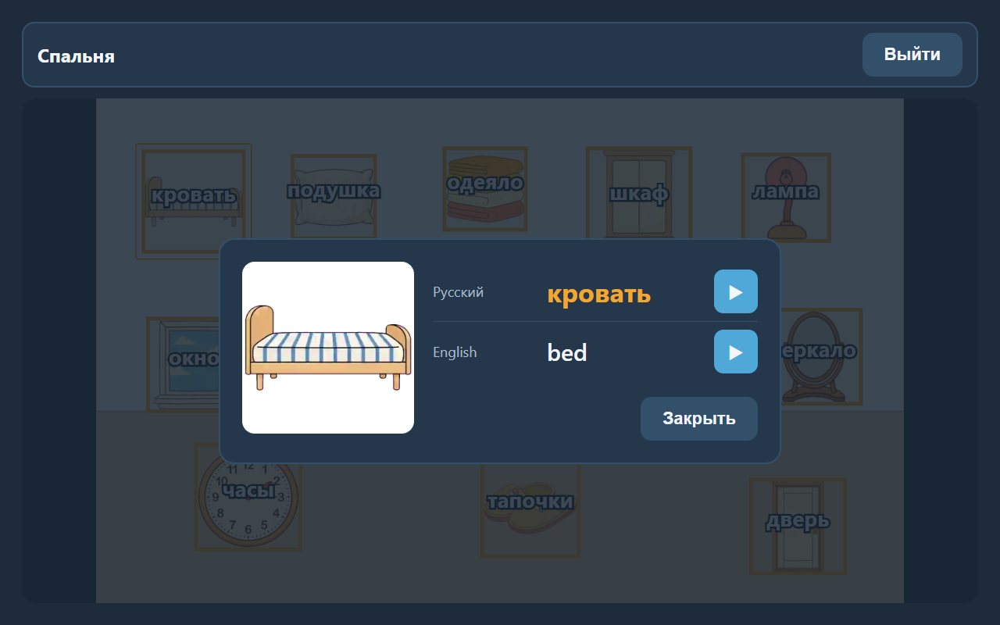

Наверху крупно и отдельно — слово на родном языке, ниже — на изучаемых. У каждого слова кнопка ▶: нажмите, чтобы услышать произношение. При открытии карточки слово звучит на изучаемых языках по очереди.

Если кнопка ▶ погашена, произношение этого слова ещё не записано.

---

## Режим «Тренировка»

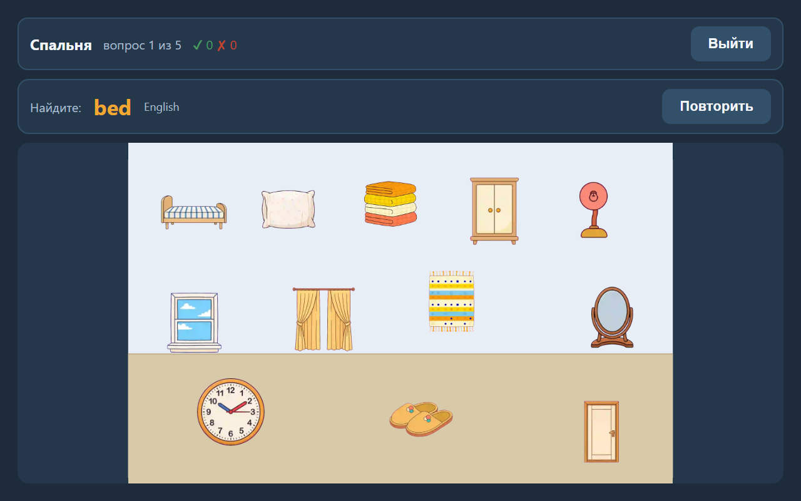

Подписи исчезают. Вверху появляется полоса задания: **«Найдите: …»**, рядом — на каком языке задано слово.

Ученик ищет предмет на сцене и нажимает на него.

- **Верно** — объект подсвечивается зелёным, счёт растёт.
- **Неверно** — красным подсвечивается **тот объект, который был загадан**, чтобы ученик увидел правильный ответ. Ход при этом переходит к следующему вопросу.

Кнопка **«Повторить»** произносит слово заново — сколько угодно раз.

> Ход переходит и при ошибке намеренно. Объектов на сцене двенадцать; если бы ход оставался до попадания, ученик просто перебрал бы всю сцену.

---

## Режим «Соревнование»

То же, что тренировка, но играют двое-четверо по очереди.

Вверху написано, **чей ход**. Когда ход переходит, **всё поле поворачивается к следующему игроку** — вместе с полосой счёта и кнопками. Так каждый видит сцену лицом к себе, а не вверх ногами.

При двоих игроки садятся **напротив** друг друга, при троих третий встаёт сбоку, при четверых занимаются все четыре стороны стола.

В одном круге задания у игроков **не повторяются** — каждому достаётся своё слово.

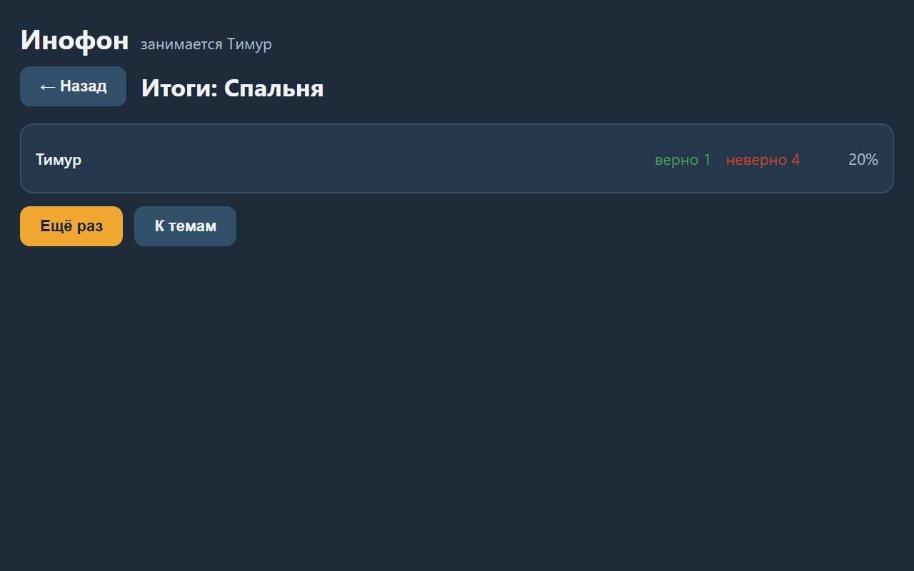

В конце — итоги: у каждого верно, неверно и доля. Объявляется победитель, а при равном счёте — **ничья с обоими именами**.

---

## Словарь

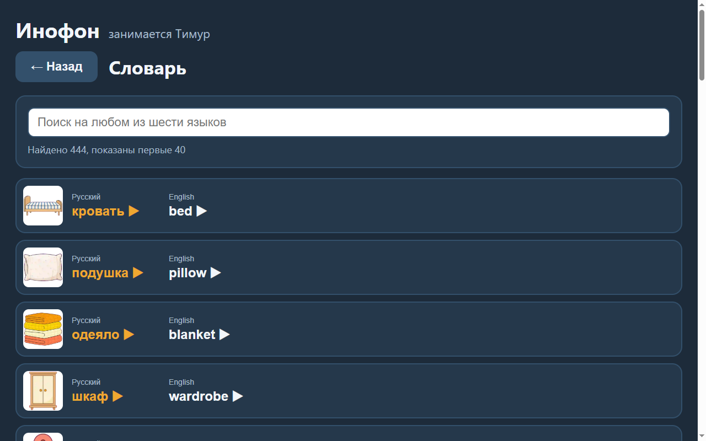

Все слова пособия с картинками и переводами. Поиск идёт **сразу по всем шести языкам**: наберите слово на любом из них.

- «ё» и регистр значения не имеют: «ковер» найдёт «ковёр», «КОВЁР» — тоже;
- можно искать по части слова;
- нажатие на слово произносит его на этом языке.

---

## Настройки

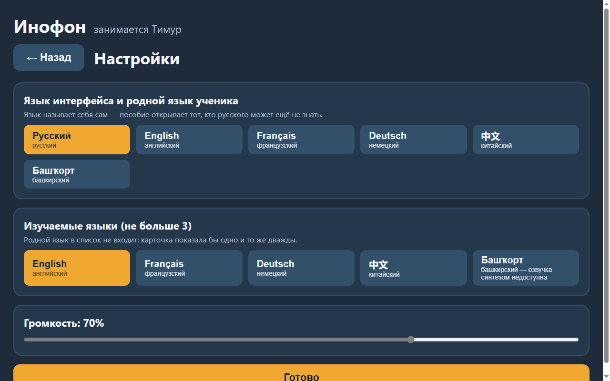

**Язык интерфейса** — он же родной язык ученика. Шесть вариантов, каждый подписан на самом себе: «English», «Français», «中文», «Башҡорт». Это сделано для того, чтобы пособие смог открыть тот, кто по-русски ещё не читает.

**Изучаемые языки** — от одного до трёх. Родной язык в этом списке не показывается: изучать язык, на котором и так говоришь, смысла нет.

**Громкость** — общая для произношения.

Настройки сохраняются на устройстве и переживают перезапуск.

---

## Результаты

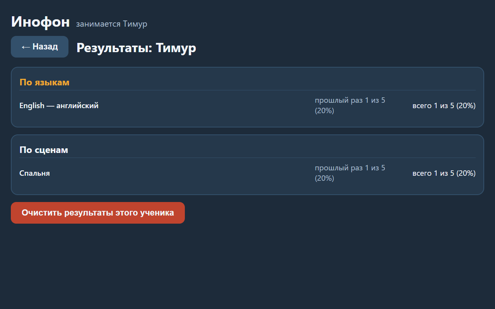

Две сводки на одного ученика:

**По языкам** — главная. Видно, что по-английски ребёнок уверен, а по-немецки путается. Ради этого пособие и существует.

**По сценам** — где ребёнок занимался.

В обеих: **«прошлый раз»** — последняя партия, **«всего»** — все партии вместе. Разделено намеренно: одно накопленное число прячет и прогресс, и провал.

Прочерк вместо доли означает, что ответов не было. Это не ноль процентов.

Кнопка внизу очищает результаты ученика, сам ученик при этом остаётся в списке.

---

## Сведения о пакете

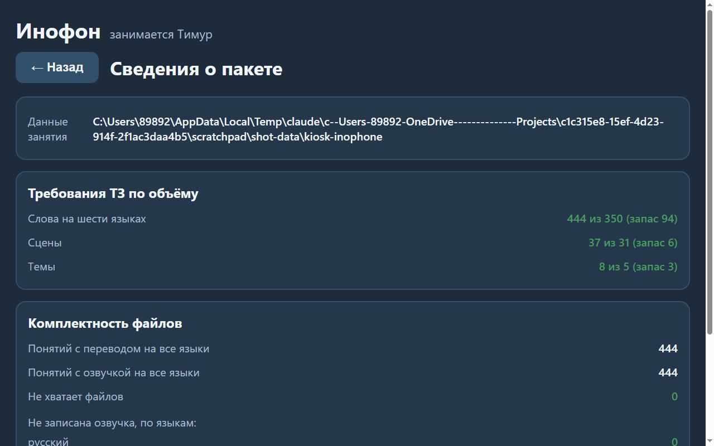

Экран для разбирательств, а не для занятия. Здесь написано:

- где лежат данные занятия;
- сколько в пособии слов, сцен и тем — и какой запас сверх требуемого;
- чего не хватает в пакете, **поимённо**;
- по каким языкам не записано произношение.

Если слово молчит или картинка не показывается — ответ здесь.

---

## Короткие ответы

**Ученик закрыл приложение посреди партии — что с результатами?** Незавершённая партия в статистику не попадает. Считаются только доигранные.

**Можно ли добавить свои слова или картинки?** Нет. Набор сцен и словарь поставляются вместе с приложением.

**Нужен ли интернет?** Нет. Приложение работает полностью автономно.

**Почему некоторые языки звучат «по-роботски»?** Живого диктора на момент сборки не было. Русский и английский озвучены голосами Windows, башкирский — моделью, обученной на живой башкирской речи, а французский, немецкий и китайский — формантным синтезатором: у них машинный призвук слышен сильнее всего.
