# «Инофон»: инструкция пользователя

**Для кого.** Для педагога, который проводит занятие, и для всех, кто впервые открыл программу. Специальных знаний не требуется: всё делается кнопками на экране, править файлы настроек не нужно нигде.

**Что это за программа.** Интерактивное наглядное пособие для изучения слов на шести языках: русском, английском, французском, немецком, китайском и башкирском. Ребёнок видит сцену — кухню, вокзал, магазин — и работает с предметами на ней: рассматривает, слушает, ищет названное слово. Программа работает без интернета: весь контент лежит на компьютере.

**Как читать этот документ.** Каждый шаг показан снимком того самого экрана, который вы увидите. Снимки сделаны с работающей программы на демонстрационных учениках «Аня» и «Миша»; служебная строка с путём к каталогу данных на снимках скрыта, потому что в демонстрационном прогоне она указывает на временную папку — настоящий путь приведён в разделе 10.

---

## Содержание

1. [Первый запуск и ученики](#1-первый-запуск-и-ученики)
2. [Темы и сцены](#2-темы-и-сцены)
3. [Настройки: языки и громкость](#3-настройки-языки-и-громкость)
4. [Настройка занятия](#4-настройка-занятия)
5. [Режим «Обучение»](#5-режим-обучение)
6. [Режим «Тренировка»](#6-режим-тренировка)
7. [Режим «Соревнование»](#7-режим-соревнование)
8. [Словарь](#8-словарь)
9. [Результаты](#9-результаты)
10. [Сведения о пакете и где лежат данные](#10-сведения-о-пакете-и-где-лежат-данные)
11. [Если что-то пошло не так](#11-если-что-то-пошло-не-так)

---

## 1. Первый запуск и ученики

При первом запуске список учеников пуст.

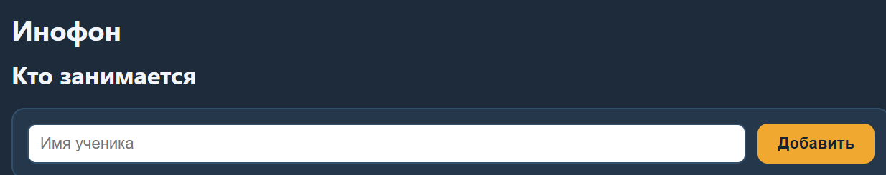

**Зачем нужны ученики.** Программа ведёт результаты по каждому ребёнку отдельно. Без выбранного ученика занятие не начнётся.

**Как добавить.** Наберите имя в поле и нажмите «Добавить».

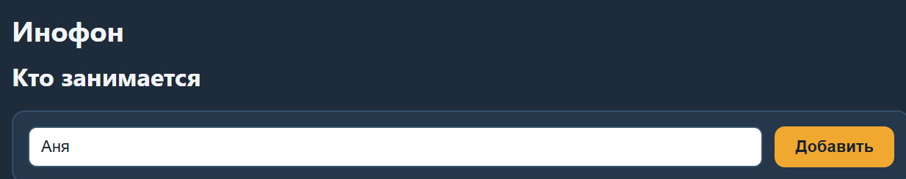

Добавьте столько детей, сколько сядет за стол, — **до четырёх** могут играть одновременно.

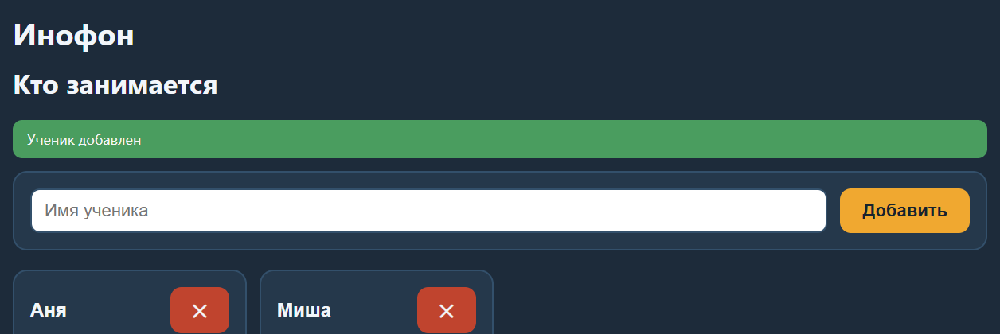

Нажмите на имя, чтобы начать с этим учеником. Сменить ученика можно в любой момент кнопкой **«← Назад»** из каталога тем.

> **Удаление ученика убирает и все его результаты.** Это сделано намеренно: иначе новый ученик с тем же именем однажды получил бы чужие оценки.

---

## 2. Темы и сцены

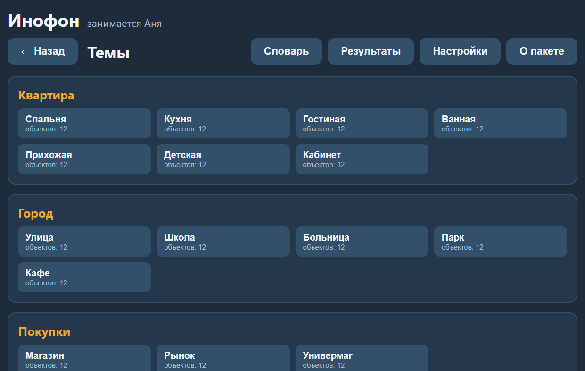

Темы раскрыты списком, под каждой — её сцены. У каждой сцены написано, сколько на ней объектов.

Всего восемь тем: **Квартира, Город, Покупки, Человек, Путешествие, Природа, Занятия, Праздник** — тридцать семь сцен, четыреста сорок четыре слова.

Справа вверху — четыре раздела, доступные с любого места: **Словарь**, **Результаты**, **Настройки**, **О пакете**.

Нажмите на сцену, чтобы перейти к настройке занятия.

---

## 3. Настройки: языки и громкость

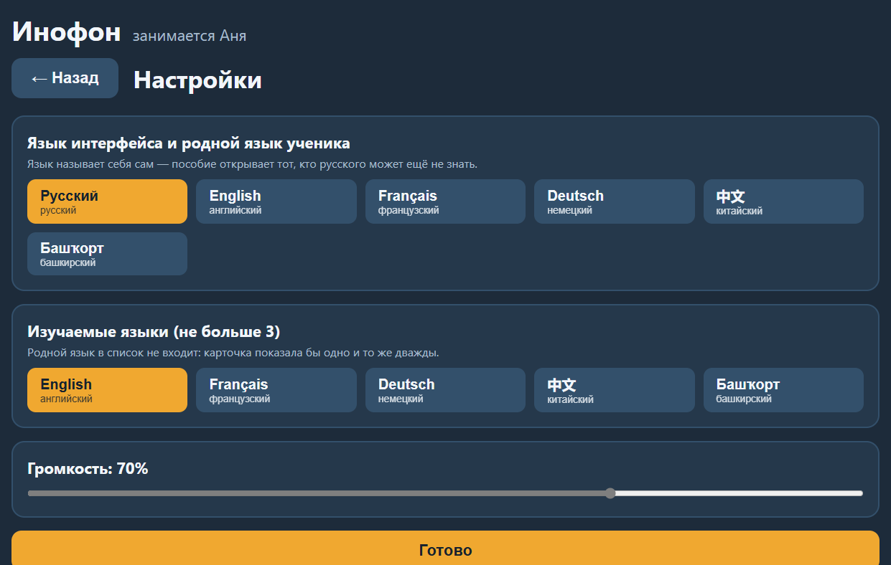

**Язык интерфейса — он же родной язык ученика.** Шесть вариантов, и каждый подписан **на самом себе**: «English», «Français», «中文», «Башҡорт». Это сделано для того, чтобы пособие смог открыть тот, кто по-русски ещё не читает.

**Изучаемые языки — от одного до трёх.**

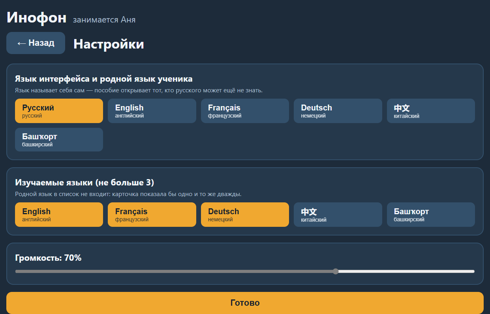

Родной язык в этом списке не показывается: изучать язык, на котором и так говоришь, смысла нет — карточка показала бы одно и то же дважды.

Больше трёх выбрать нельзя. Четвёртый язык просто не нажмётся: карточка с шестью строчками перестаёт читаться с доски.

**Громкость** — общая для произношения всех языков.

Настройки сохраняются на устройстве и переживают перезапуск. Они **важнее выставленных в редакторе**: проект собирает методист заранее и один раз, а язык интерфейса меняют под конкретного ученика прямо на занятии.

---

## 4. Настройка занятия

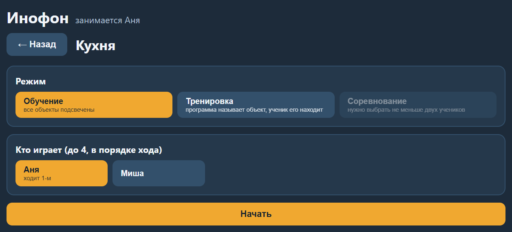

Здесь выбирается всё, что нужно до начала.

**Режим.** Три варианта, и под каждым написано, чем он отличается. «Соревнование» погашено, пока выбран один ученик, — причина написана прямо под названием: нужно не меньше двух.

**Кто играет.** Отметьте учеников в том порядке, в каком они ходят. Под каждым отмеченным написано, каким он ходит. Больше четырёх выбрать нельзя.

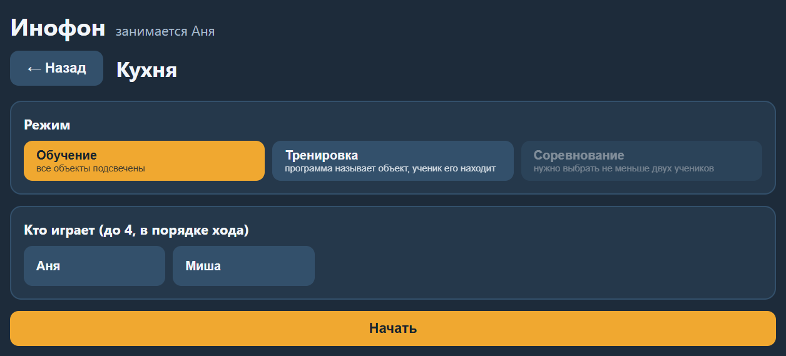

**Вопросов каждому.** 5, 10, 15 или 20. В обучении этого выбора нет — там партии не бывает.

**Как задавать объект.** Программа может произносить слово, показывать его написание или делать то и другое. Выключить оба нельзя: ученику будет нечего искать.

---

## 5. Режим «Обучение»

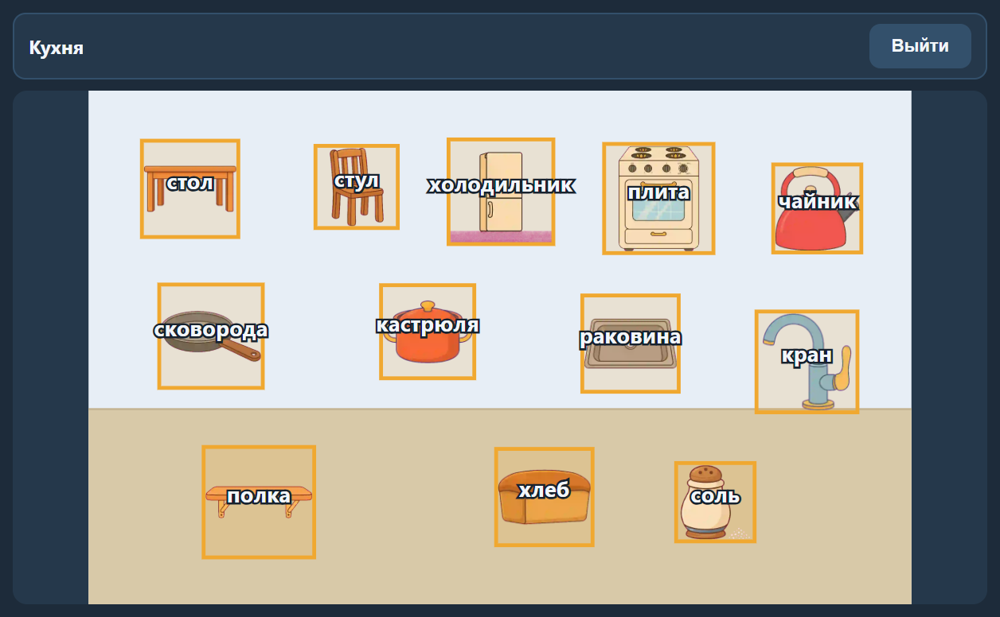

Все объекты подсвечены и подписаны на родном языке. Здесь нет ни счёта, ни очерёдности — ребёнок просто разглядывает сцену и щёлкает по тому, что интересно.

Щелчок открывает **карточку объекта**:

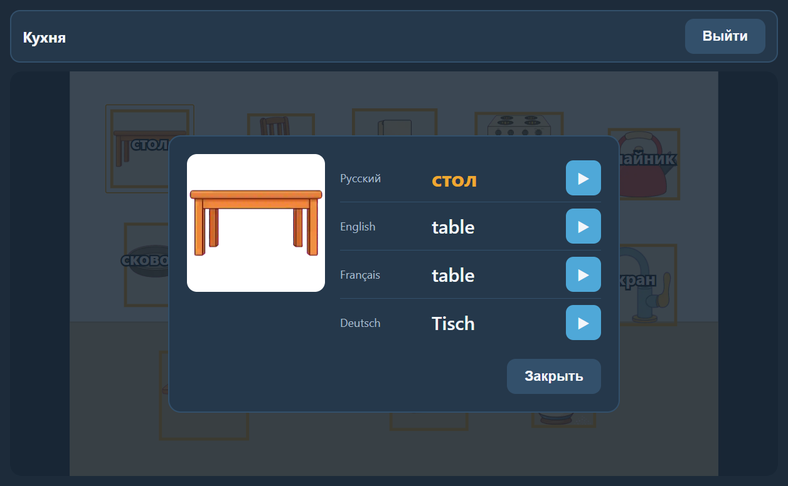

Наверху крупно и отдельно — слово на родном языке, ниже — на изучаемых. У каждого слова кнопка ▶: нажмите, чтобы услышать произношение. При открытии карточки слово звучит на изучаемых языках по очереди.

Если кнопка ▶ погашена, произношение этого слова ещё не записано.

---

## 6. Режим «Тренировка»

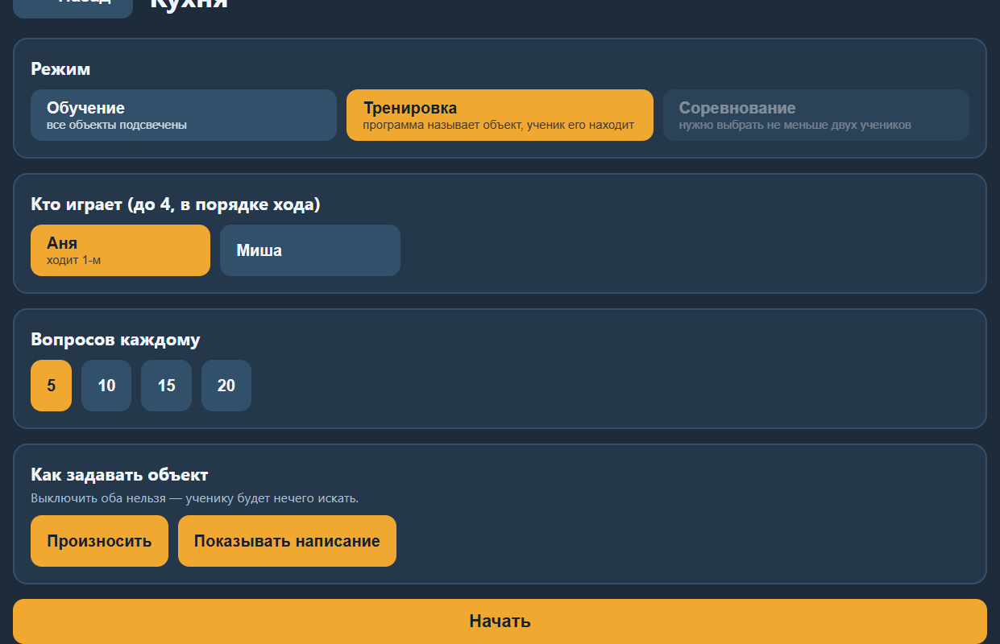

В тренировке появляется выбор числа вопросов. Пять — для короткого занятия, двадцать — для полного.

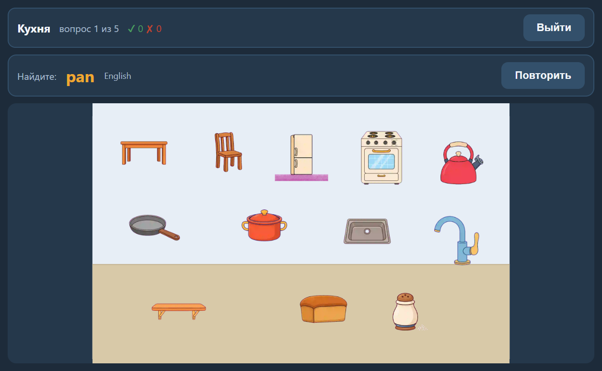

Подписи исчезают. Вверху появляется полоса задания: **«Найдите: …»**, рядом — на каком языке задано слово. Слева видно, какой это вопрос по счёту и сколько верных и неверных ответов уже есть.

Ребёнок ищет предмет на сцене и нажимает на него.

**Верно** — объект подсвечивается зелёным.

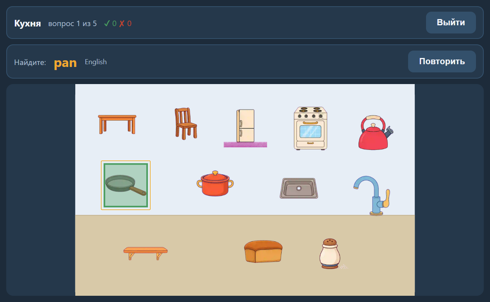

**Неверно** — красным подсвечивается **тот объект, который был загадан**, а не тот, по которому нажали.

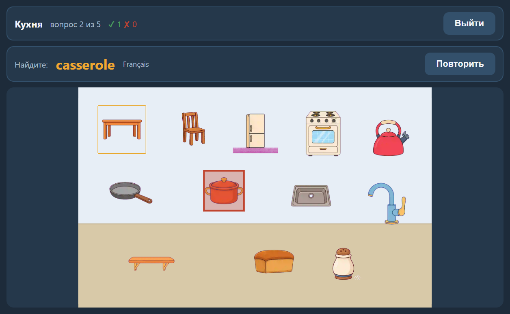

На снимке спросили французское «pain» — хлеб, ребёнок нажал на стол, и программа показала красным именно хлеб. Иначе ошибка ничему не учит: ребёнок увидел бы, что промахнулся, но не узнал бы, где было правильно.

Кнопка **«Повторить»** произносит слово заново — сколько угодно раз.

> **Ход переходит и при ошибке, и это намеренно.** Объектов на сцене двенадцать; если бы ход оставался до попадания, ребёнок просто перебрал бы всю сцену и «ответил» бы верно, ничего не выучив.

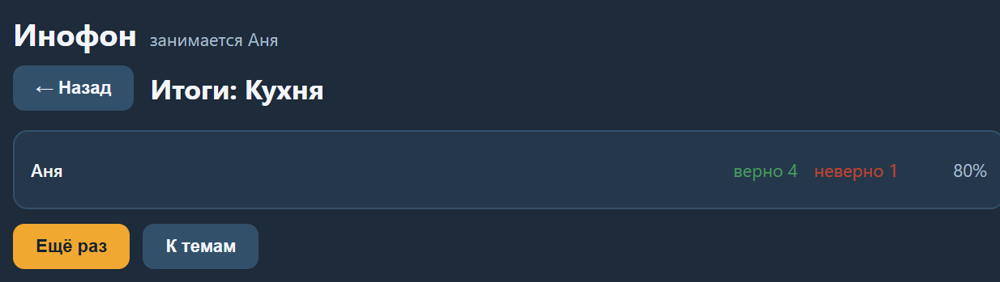

В конце — итоги: у каждого верно, неверно и доля.

---

## 7. Режим «Соревнование»

То же, что тренировка, но играют двое-четверо по очереди.

Вверху написано, **чей ход**. Когда ход переходит, **всё поле поворачивается к следующему игроку** — вместе с полосой счёта и кнопками. Так каждый видит сцену лицом к себе, а не вверх ногами.

При двоих игроки садятся **напротив** друг друга, при троих третий встаёт сбоку, при четверых занимаются все четыре стороны стола.

В одном круге задания у игроков **не повторяются** — каждому достаётся своё слово, иначе второй просто повторил бы за первым.

В конце объявляется победитель, а при равном счёте — **ничья с обоими именами**.

---

## 8. Словарь

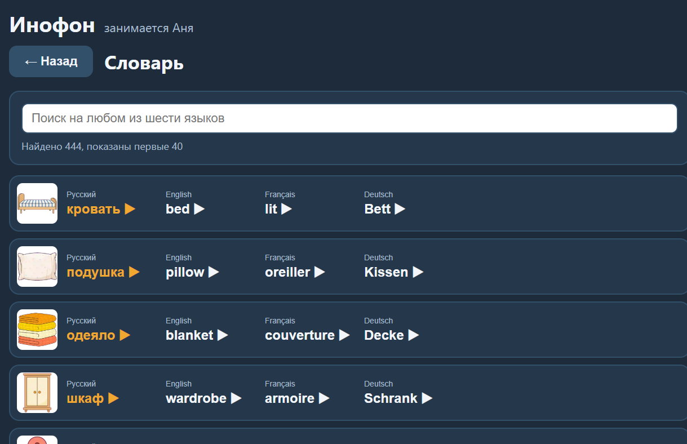

Все слова пособия с картинками и переводами.

Поиск идёт **сразу по всем шести языкам**: наберите слово на любом из них.

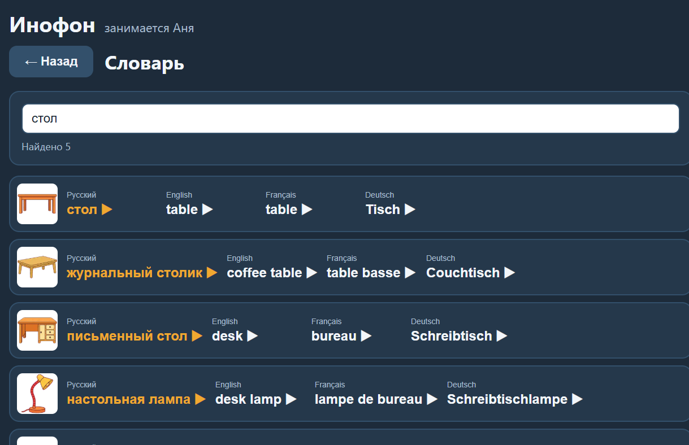

- «ё» и регистр значения не имеют: «ковер» найдёт «ковёр», «КОВЁР» — тоже;
- можно искать по части слова: «стол» найдёт и «столовую»;
- нажатие на слово произносит его на этом языке.

---

## 9. Результаты

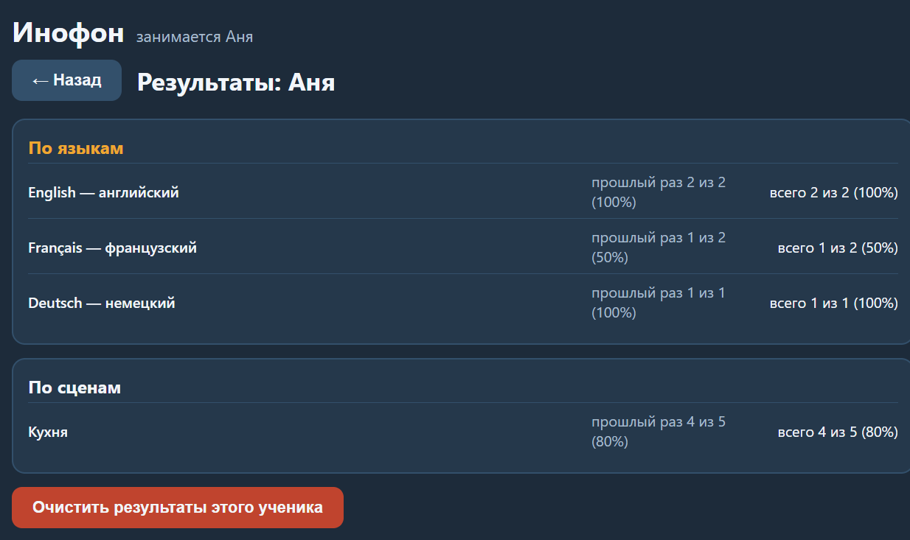

Две сводки на одного ученика.

**По языкам** — главная. Видно, что по-английски ребёнок уверен, а по-французски путается. Ради этого пособие и существует: шесть языков в одном пособии нужны затем, чтобы сравнить.

**По сценам** — где ребёнок занимался.

В обеих: **«прошлый раз»** — последняя партия, **«всего»** — все партии вместе. Разделено намеренно: одно накопленное число прячет и прогресс, и провал.

Прочерк вместо доли означает, что ответов не было. Это **не** ноль процентов.

Кнопка внизу очищает результаты этого ученика, сам ученик при этом остаётся в списке.

> Незавершённая партия в результаты не попадает. Если ребёнок вышел посреди занятия, считаются только доигранные партии.

---

## 10. Сведения о пакете и где лежат данные

Экран **«О пакете»** — для разбирательств, а не для занятия.

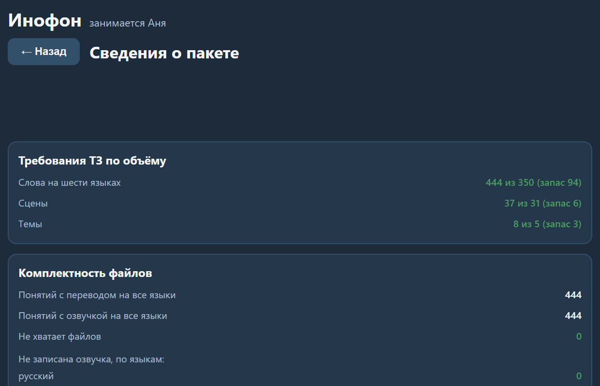

Самая верхняя панель этого экрана — **путь к каталогу данных занятия**, где лежат ученики, настройки и результаты. На снимке она скрыта: снимок сделан на стенде, и путь в нём указывал бы на временную папку.

На рабочем компьютере путь такой:

```
C:\ProgramData\kiosk-inophone
```

Если у программы нет прав писать в общий каталог, она пишет в профиль пользователя и **говорит об этом прямо на этом экране** отдельной строкой «Внимание». Молча переключиться она не может: иначе результаты «пропадали» бы при смене пользователя, и понять почему было бы нельзя.

Дальше — объём пакета против требований: сколько слов, сцен и тем, и какой запас сверх требуемого.

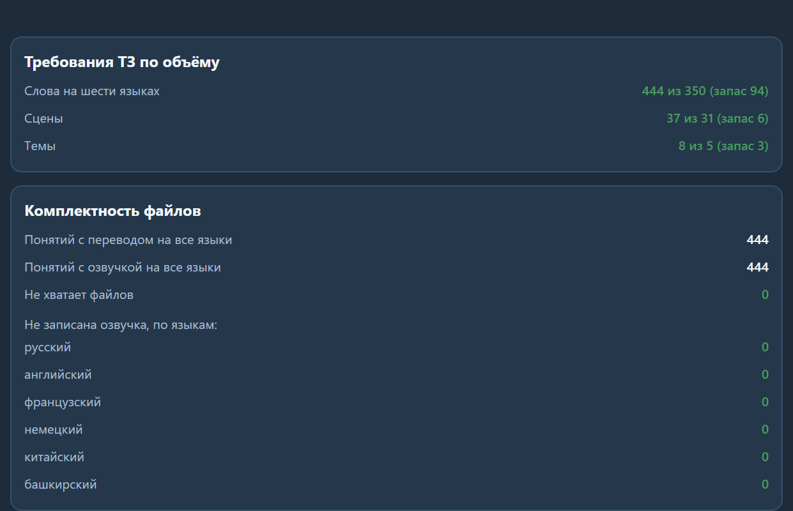

Нижняя панель отвечает на вопрос «чего не хватает», и отвечает **поимённо**: сколько понятий переведено на все языки, сколько озвучено, сколько файлов недостаёт и по каким языкам не записано произношение.

Если слово молчит или картинка не показывается — ответ здесь.

---

## 11. Если что-то пошло не так

**Слово не произносится, кнопка ▶ погашена.** Произношение этого слова на этом языке не записано. Откройте «О пакете» — там сказано, по каким языкам и скольких записей не хватает.

**Ученик закрыл программу посреди партии.** Ничего не потеряно, кроме самой партии: она в результаты не попадёт. Ученики, настройки и прошлые результаты на месте.

**Список учеников пуст, хотя вчера там были дети.** Скорее всего, программу запустили под другим пользователем Windows, и она пишет в профиль пользователя, а не в общий каталог. Откройте «О пакете» и посмотрите путь и строку «Внимание».

**Программа открылась, а сцен нет.** На экране будет написано «Пакет учебного контента не подключён». Это значит, что папка с картинками и звуком не доехала до компьютера. Кнопка «Сведения о пакете» на том же экране покажет, что именно программа не нашла.

**Некоторые языки звучат «по-роботски».** Живого диктора на момент сборки не было. Русский и английский озвучены голосами Windows, башкирский — моделью, обученной на живой башкирской речи, а французский, немецкий и китайский — формантным синтезатором: у них машинный призвук слышен сильнее всего.

---

## Чего в программе нет

- **Своих слов и своих картинок.** Набор сцен и словарь поставляются вместе с приложением и не редактируются. В отличие от «Я знаю много слов» и «АзбукоСлов», у «Инофона» по ТЗ нет редактора контента педагога.
- **Интернета.** Приложение работает полностью автономно и ничего никуда не отправляет.
- **Пароля педагога.** Здесь нет разделов, которые надо было бы закрывать от детей: всё, что есть на экране, — учебное.
