# «ФизАстроIQ»: инструкция пользователя

**Для кого.** Для учителя физики или астрономии, который проводит викторину в классе, и для всех, кто впервые открыл программу. Специальных знаний не требуется: всё делается кнопками на экране, править файлы настроек не нужно нигде.

**Что это за программа.** Игра-викторина по физике и астрономии для интерактивной доски или панели. Вопрос привязан к объекту на изображении: игрок читает вопрос и нажимает на нужный объект — прибор на схеме цепи, простой механизм, планету, созвездие. Балл убывает вместе с таймером. Играют по очереди, до трёх человек. Есть редактор: учитель собирает собственную викторину на своих изображениях. Программа работает без интернета.

**Предметов два.** В программе две готовые викторины — «Физика» и «Астрономия», по 90 вопросов каждая. Предмет выбирается одной кнопкой на первом же экране; всё остальное у них устроено одинаково.

**Как читать этот документ.** Каждый шаг показан снимком того самого экрана, который вы увидите. Снимки сделаны с работающей программы на демонстрационных игроках «Аня» и «Миша» и пересняты 20.09.2026 на текущей сборке.

---

## Содержание

1. [Стартовый экран и выбор предмета](#1-стартовый-экран-и-выбор-предмета)
2. [Справочные материалы](#2-справочные-материалы)
3. [Настройка игры](#3-настройка-игры)
4. [Игровое поле](#4-игровое-поле)
5. [Итоги и детализация](#5-итоги-и-детализация)
6. [Второй предмет: астрономия](#6-второй-предмет-астрономия)
7. [Режим учителя и PIN](#7-режим-учителя-и-pin)
8. [Статистика по дням](#8-статистика-по-дням)
9. [Свои викторины](#9-свои-викторины)
10. [Редактор викторины](#10-редактор-викторины)
11. [Обмен викторинами](#11-обмен-викторинами)
12. [Где лежат данные](#12-где-лежат-данные)
13. [Если что-то пошло не так](#13-если-что-то-пошло-не-так)

---

## 1. Стартовый экран и выбор предмета

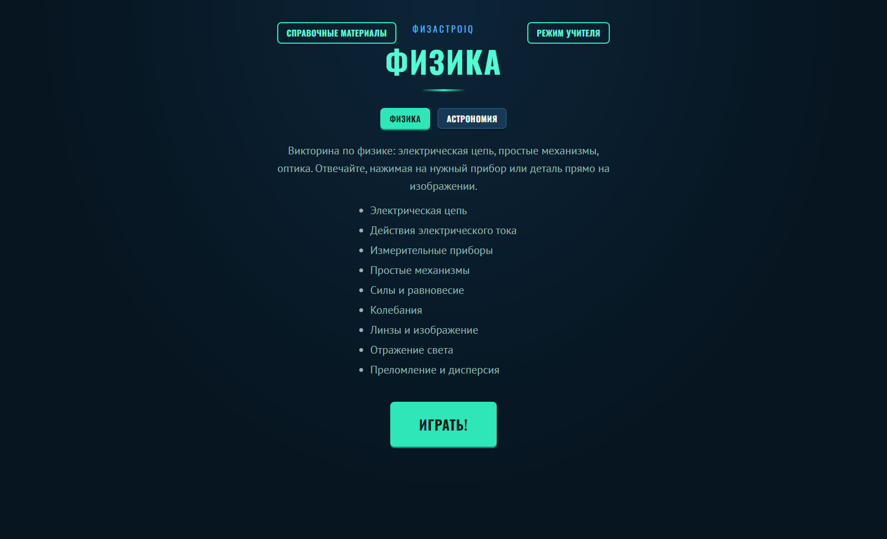

Программа открывается на описании викторины: по чему она, какие в ней темы и как отвечать.

Под заголовком — **переключатель предмета**: «Физика» и «Астрономия». Нажмите нужный, и описание с темами сменится. Выбранный предмет запоминается: в следующий раз программа откроется на нём же.

Три кнопки ведут дальше:

- **«Играть!»** — начать партию;
- **«Справочные материалы»** (слева вверху) — чертежи и схемы для объяснения у доски;
- **«Режим учителя»** (справа вверху) — каталог викторин, статистика и редактор.

---

## 2. Справочные материалы

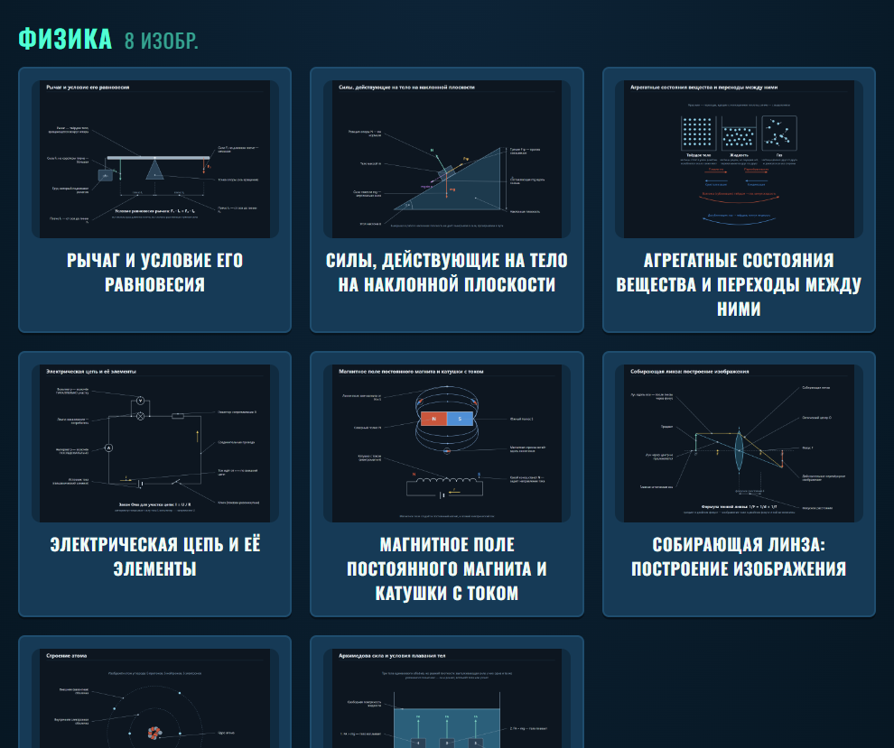

Раздел открыт **всем** и не спрятан за PIN: это учебный материал, а не инструмент правки.

Материалы разделены по предметам. В разделе **«Физика»** — восемь чертежей, по одному на раздел школьного курса: рычаг, силы на наклонной плоскости, агрегатные состояния вещества, электрическая цепь, магнитное поле, собирающая линза, строение атома, архимедова сила.

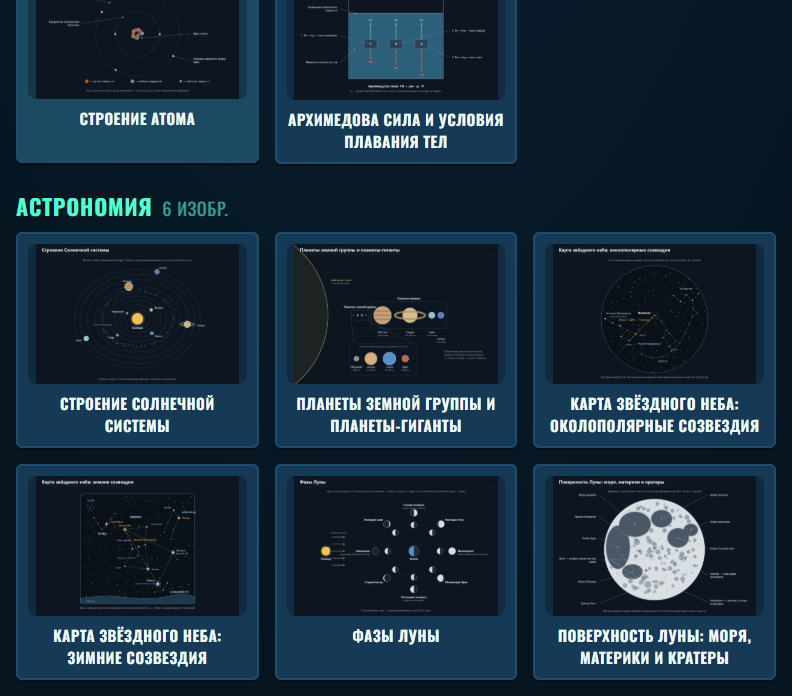

Ниже — раздел **«Астрономия»**: шесть изображений по трём темам, по два на каждую. Строение Солнечной системы и сравнение планет; две карты звёздного неба — околополярная и зимняя; фазы Луны и поверхность Луны.

Нажмите на плитку, чтобы открыть чертёж целиком.

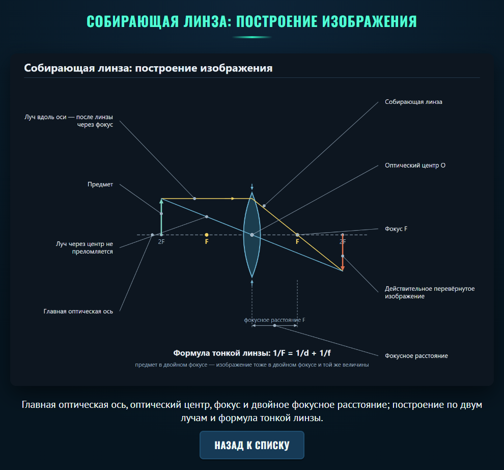

Под изображением — пояснение: что на нём показано и на что обратить внимание. Чертёж можно показать на доске и разобрать, а потом закрыть кнопкой **«Назад к списку»**.

---

## 3. Настройка игры

Нажмите **«Играть!»**. Программа задаст четыре вопроса подряд.

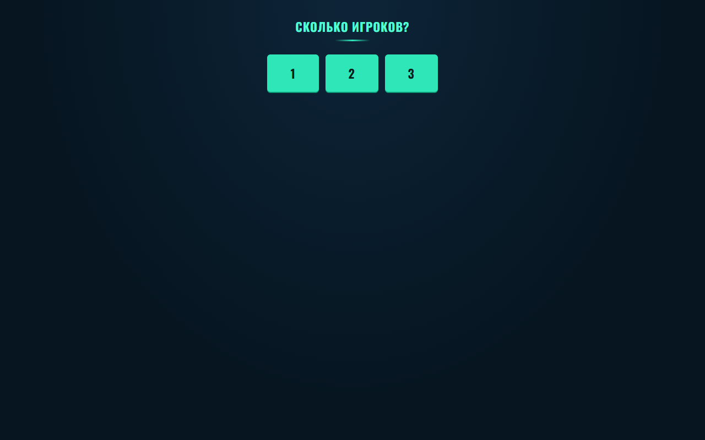

**Сколько игроков** — от одного до трёх. Играют по очереди: ход переходит по кругу.

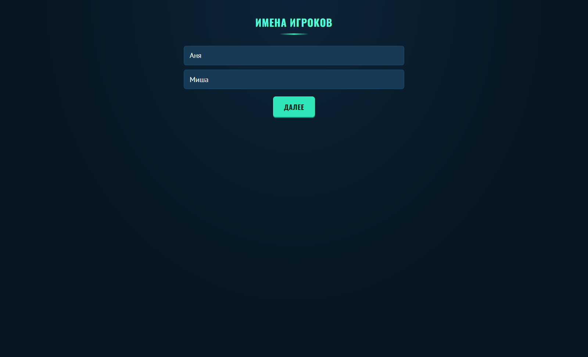

**Имена игроков.** Они появятся на поле, в итогах и в статистике.

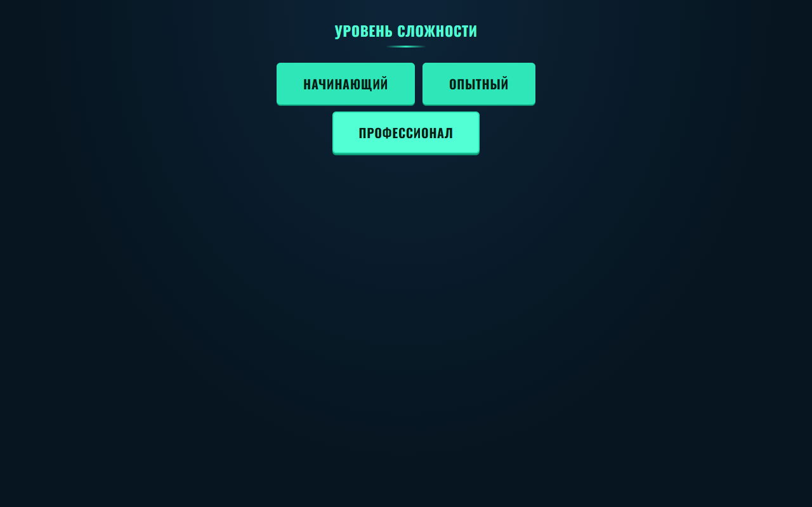

**Уровень сложности.** Их три, и это не одни и те же вопросы «потруднее»: у каждого уровня **своя карта и свой набор вопросов**.

| Уровень | Физика | Астрономия | Вес вопроса | Время |
|---|---|---|--:|--:|
| Начинающий | Электрическая цепь | Солнечная система | 100 | 35 с |
| Опытный | Простые механизмы и силы | Звёздное небо | 130 | 30 с |
| Профессионал | Оптика: линзы, зеркала, ход лучей | Земля, Луна и затмения | 170 | 25 с |

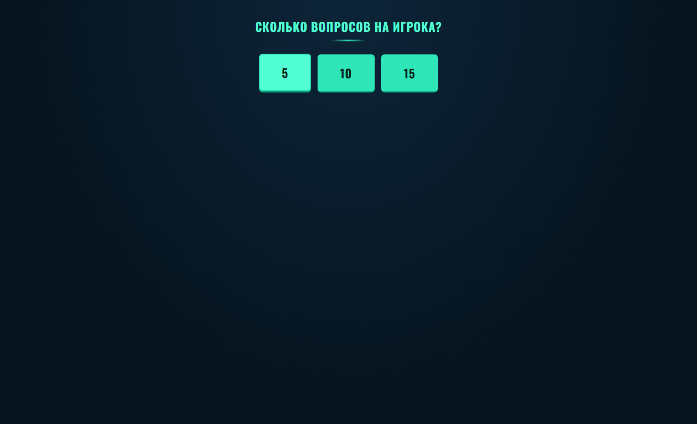

**Сколько вопросов** достанется каждому игроку: 5, 10 или 15. Вопросы раздаются так, чтобы у игроков они не повторялись.

---

## 4. Игровое поле

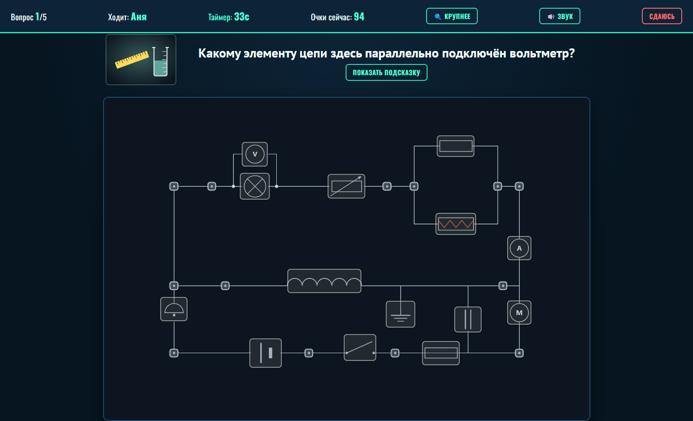

Сверху слева направо: номер вопроса, чей ход, таймер, текущая стоимость ответа.

**Картинка слева от вопроса** показывает его тему — измерительные приборы, оптику, планеты, Луну. Она общая для всех вопросов темы и ответа не подсказывает: на ней нарочно нет ни одного объекта, который нужно искать на поле. Если педагог приложил к вопросу свою картинку, на этом месте будет она.

**Как отвечать.** Прочитайте вопрос и нажмите на нужный объект прямо на изображении. Кликабельные места подсвечены — правильное среди них одно, остальные похожи на него и служат для того, чтобы ответ был осознанным, а не угаданным.

**Балл убывает вместе с таймером.** «Очки сейчас» показывают, сколько вы получите, ответив в эту секунду. Ответ до истечения времени всегда лучше, чем правильный, но поздний.

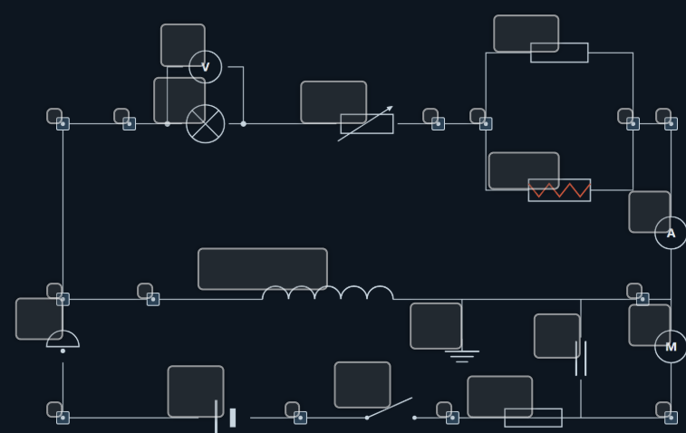

**«Показать подсказку»** объясняет признак, по которому объект узнают, — но не называет его. «Две параллельные пластины с зазором между ними» — подсказка; «это конденсатор» подсказкой не является, это ответ.

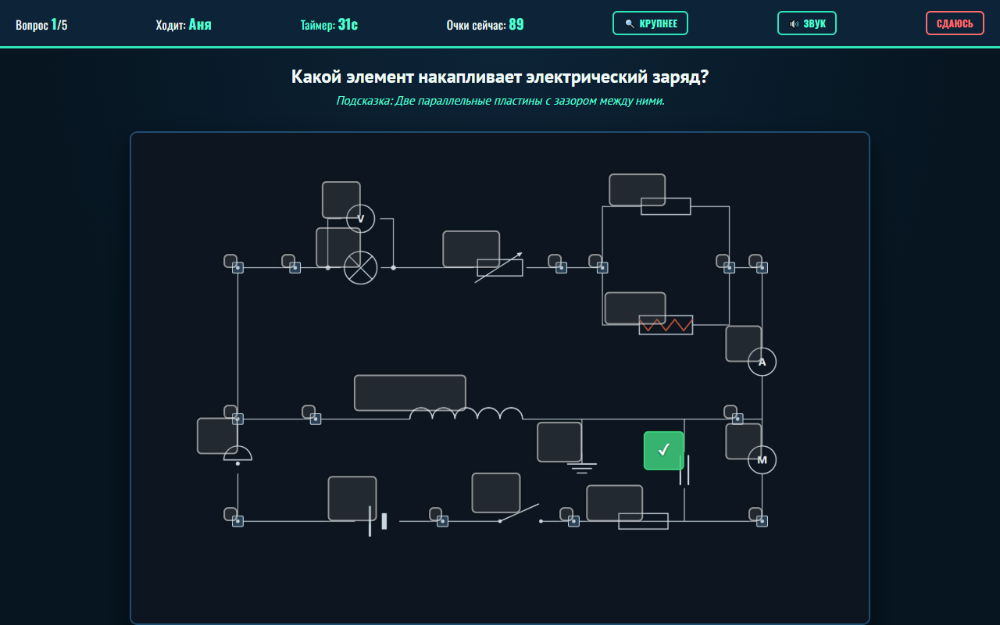

Верный ответ подсвечивается, очки начисляются, ход переходит к следующему игроку.

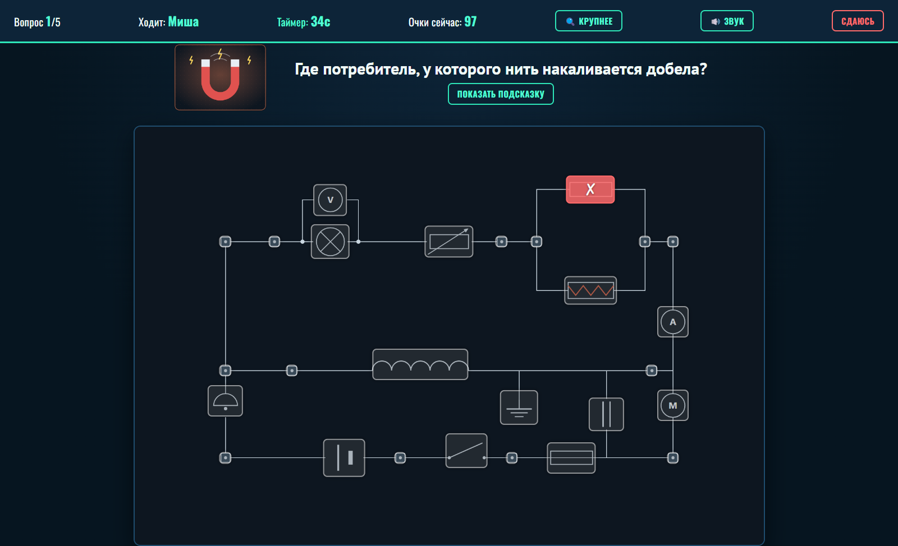

При неверном ответе видно и то, что было выбрано, и то, что было правильным.

**«Сдаюсь»** пропускает вопрос без начисления очков — если игрок не знает ответа и не хочет ждать таймер.

**«Крупнее»** увеличивает изображение: полезно на небольшом экране. **«Звук»** выключает сигналы «верно» и «неверно».

---

## 5. Итоги и детализация

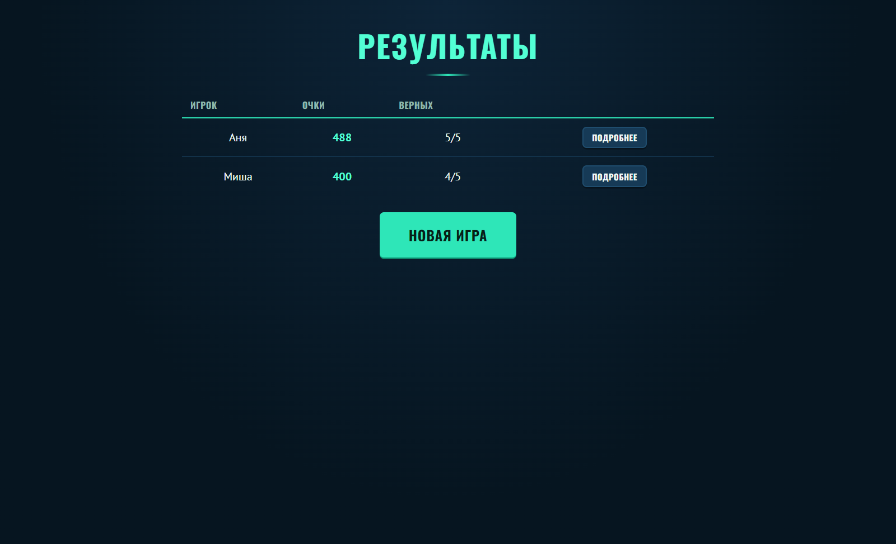

По окончании — таблица: очки и доля верных ответов у каждого игрока.

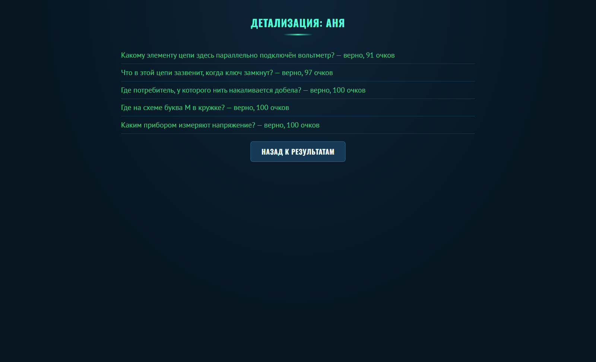

Кнопка **«Подробнее»** раскрывает партию по вопросам: что спрашивали, что игрок ответил, верно или нет, сколько очков и за сколько секунд. Именно этот экран удобно разбирать с классом после игры.

---

## 6. Второй предмет: астрономия

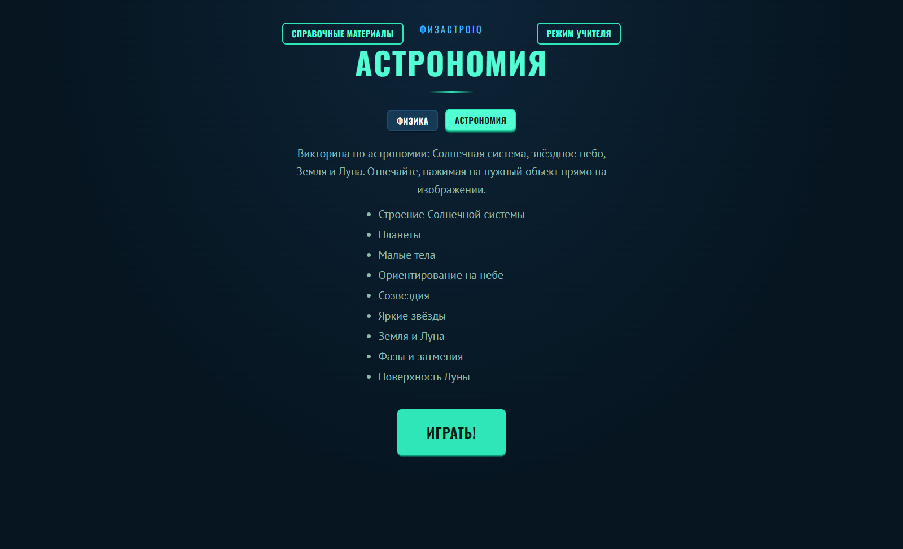

Вернитесь на стартовый экран и нажмите **«Астрономия»** — сменятся описание, список тем и весь банк вопросов.

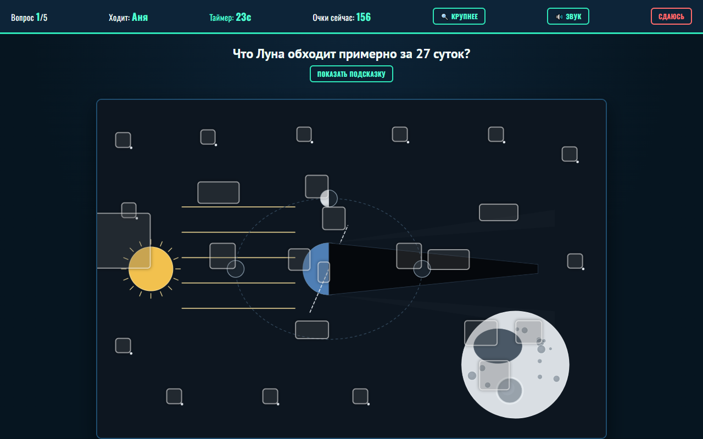

Механика та же, карта и вопросы другие. На снимке — уровень «Профессионал»: система Земля—Луна с конусом земной тени, орбитой Луны и увеличенным лунным диском в углу.

---

## 7. Режим учителя и PIN

Режим учителя закрыт PIN-кодом. **При первом входе его задают здесь же** — придумайте любой и введите дважды.

PIN защищает от правки викторин учениками. Он хранится в зашифрованном виде и восстановлению не подлежит — если PIN забыт, обратитесь к администратору (порядок сброса описан в руководстве администратора).

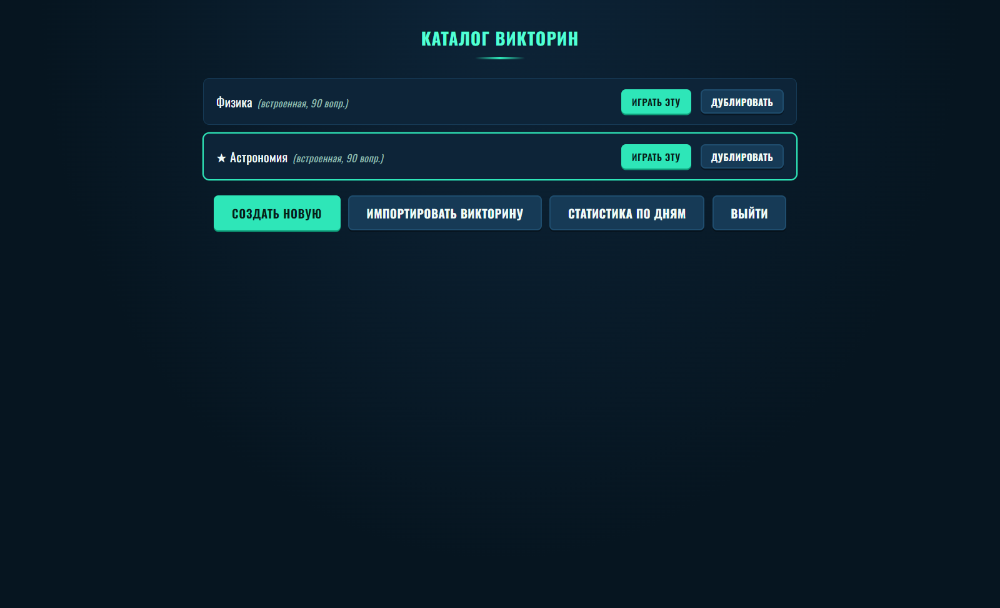

За PIN-кодом — каталог. Сверху обе **встроенные** викторины, «Физика» и «Астрономия», с числом вопросов. Их нельзя испортить: доступны только «Играть эту» и «Дублировать».

Ниже появятся ваши собственные викторины.

---

## 8. Статистика по дням

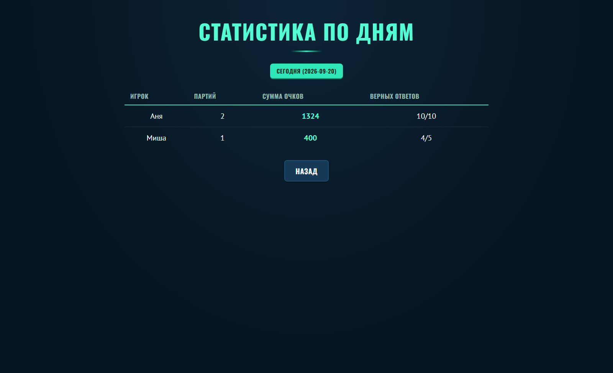

Сводка по всем, кто играл: имя, число партий, сумма очков, доля верных ответов. Переключатель показывает либо всё время, либо только сегодняшний день — удобно, когда за смену прошло несколько классов.

---

## 9. Свои викторины

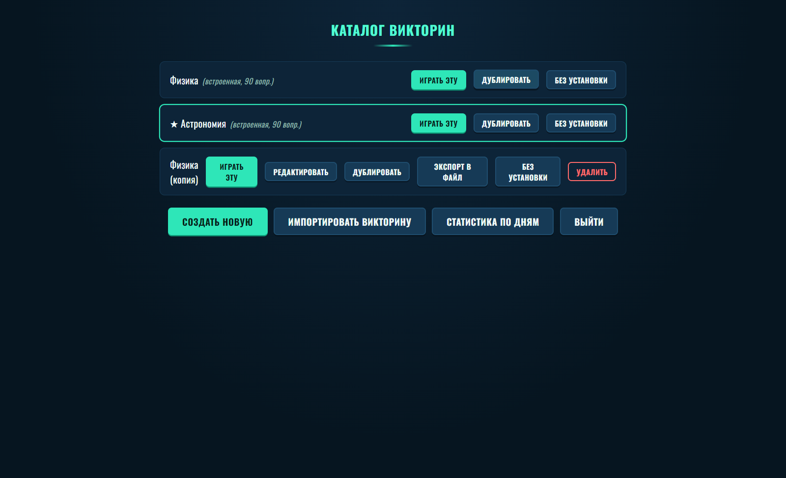

Свою викторину делают двумя способами.

**«Дублировать»** — сделать копию встроенной и править её. Самый быстрый путь: карты, точки ответов и все 90 вопросов уже на месте, остаётся заменить то, что нужно. Оригинал при этом не меняется.

**«Создать новую»** — начать с нуля: программа попросит изображение для первого уровня и откроет пустой редактор.

У своей викторины доступны «Редактировать», «Дублировать», «Экспорт в файл» и «Удалить». Кнопка **«Задать пароль»** в редакторе закрывает викторину от правки: без пароля её можно играть, но не менять.

---

## 10. Редактор викторины

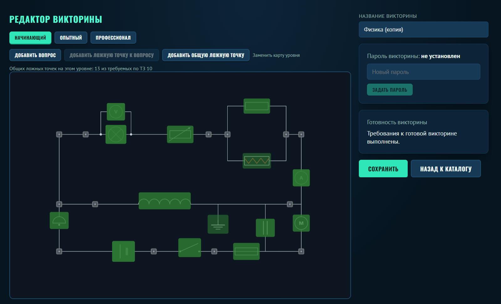

Слева — карта уровня, справа — свойства. Уровень переключается кнопками «Начинающий», «Опытный», «Профессионал»: у каждого своя карта и свои вопросы.

**Как добавить вопрос:**

1. Нажмите **«Добавить вопрос»**.
2. Щёлкните по карте в том месте, где находится правильный ответ.

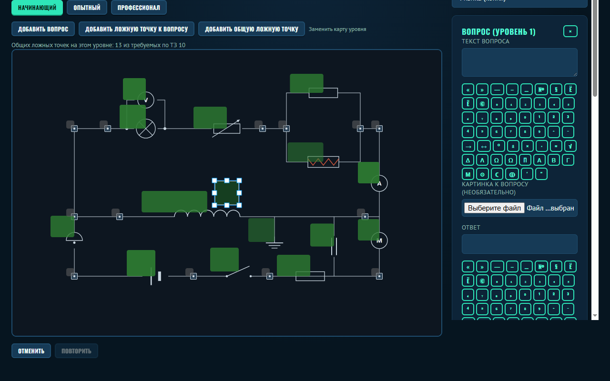

3. Справа откроется форма. Заполните текст вопроса, ответ и подсказку, задайте **вес** (сколько баллов) и **тему**.
4. При необходимости приложите картинку к вопросу, ответу или подсказке.

**Спецсимволы.** Под каждым полем — панель символов, которых нет на клавиатуре: индексы и степени (v₀, 10⁻¹⁹, м/с²), знаки √ π Δ λ ω Ω, α β γ, точка умножения для единиц (Н·м), градус и угловые минуты, астрономические ☉ ☾ ⊕. Нажатие вставляет символ в то поле, под которым панель расположена.

**Ложные точки.** Это места на карте, по которым можно нажать, но которые ответом не бывают. Без них игра превращается в угадывание: если кликабельно только правильное место, задача сводится к «найди подсвеченный прямоугольник».

- **«Добавить ложную точку к вопросу»** — обманка для одного конкретного вопроса;
- **«Добавить общую ложную точку»** — обманка, действующая на всём уровне.

Под кнопками программа считает: **«Общих ложных точек на этом уровне: 13 из требуемых по ТЗ 10»**. Пока их меньше десяти, викторина считается недоделанной, и об этом будет сказано в блоке «Готовность викторины».

**«Заменить карту уровня»** позволяет поставить своё изображение. Точки при этом останутся на прежних местах — проверьте, что они по-прежнему указывают куда надо.

**«Отменить» и «Повторить»** откатывают последние действия.

Не забудьте **«Сохранить»**: выход без сохранения спросит подтверждение.

---

## 11. Обмен викторинами

Викторину можно передать коллеге или перенести на другой компьютер.

**Отдать:** в каталоге у своей викторины нажмите **«Экспорт в файл»** и сохраните `.physastroiq.json`. Изображения уровней лежат внутри файла — ничего дополнительно копировать не нужно.

**Принять:** в каталоге нажмите **«Импортировать викторину»** и выберите файл. Викторина появится в списке.

Викторина, защищённая паролем, переносится вместе с ним.

### Викторина без установки

Бывает нужно провести викторину там, где программы нет: в соседнем кабинете, на открытом уроке в другой школе, на домашнем компьютере ученика. Для этого в каталоге у каждой викторины есть кнопка **«Без установки»**.

1. Нажмите **«Без установки»** и выберите папку — например, на флешке.
2. В папке появятся два файла: таблица Excel с вопросами и `player.html`.
3. На любом компьютере откройте `player.html` двойным щелчком — он откроется в браузере — и выберите в нём таблицу. Установка, права администратора и интернет не нужны; подойдёт и компьютер с Windows 7.

В такой викторине нет карт и картинок: вопросы текстовые, ответ выбирают из четырёх вариантов. Остальное привычно — до трёх игроков, три уровня, таймер, подсказка, «Сдаюсь», итоги с детализацией.

У встроенных викторин выгружается готовый текстовый банк: **390 вопросов по астрономии** и 90 по физике. У своей викторины — её вопросы, ответы и подсказки; неверные варианты проигрыватель подберёт сам из ответов на другие вопросы той же темы, а при желании их можно вписать в таблицу вручную. Таблицу вообще можно править в Excel как угодно — устройство файла описано в `physastroiq-standalone-player.md`.

---

## 12. Где лежат данные

Программа хранит всё на том же компьютере и в интернет ничего не отправляет.

- история партий и статистика;
- ваши викторины и их изображения;
- PIN режима учителя (в зашифрованном виде).

Точный путь и порядок резервного копирования — в руководстве администратора.

**Данные у каждого пользователя Windows свои.** Если вы вошли под другой учётной записью, ваших викторин не будет видно — переносите их экспортом (раздел 11).

---

## 13. Если что-то пошло не так

**На стартовом экране появилось предупреждение о том, что сохранённые данные не удалось прочитать.** Файл с историей партий повреждён. Программа начала с чистого состояния и работает нормально; новые партии сохраняются. Старую статистику восстановить нельзя. Сообщение показывается один раз — чтобы пустая статистика не была принята за «ещё не играли».

**Импорт викторины ничего не делает.** Проверьте расширение файла: нужен `.physastroiq.json`. Файлы других викторин платформы (`.bioiq.json`, `.chimiq.json`) этой программой не открываются.

**Переключателя «Физика / Астрономия» не видно.** Значит, активной назначена ваша собственная викторина, а не встроенная. Так задумано: переключатель не должен молча сбрасывать ваш выбор. Чтобы вернуть его, зайдите в режим учителя и нажмите «Играть эту» у встроенной викторины.

**Пропали свои викторины.** Скорее всего, вход выполнен под другой учётной записью Windows — см. раздел 12.

**Забыт PIN режима учителя.** Восстановить нельзя, можно только сбросить — обратитесь к администратору.
