# «Я знаю много слов»: инструкция пользователя

**Для кого.** Для педагога, который проводит занятие, и для всех, кто впервые открыл программу. Специальных знаний не требуется: всё делается кнопками на экране, править файлы настроек не нужно нигде.

**Что это за программа.** Интерактивное наглядное пособие: ребёнок слышит и видит слово и находит нужную карточку среди других. Программа работает без интернета — весь контент лежит на компьютере.

**Как читать этот документ.** Каждый шаг показан снимком того самого экрана, который вы увидите. Снимки сделаны с работающей программы на демонстрационных игроках «Аня» и «Миша».

---

## Содержание

1. [Главное меню](#1-главное-меню)
2. [Игроки](#2-игроки)
3. [Тема и рассадка](#3-тема-и-рассадка)
4. [Ход занятия](#4-ход-занятия)
5. [Итоги и награды](#5-итоги-и-награды)
6. [Разделы педагога и пароль](#6-разделы-педагога-и-пароль)
7. [Настройки и уровни](#7-настройки-и-уровни)
8. [Свои слова и комплекты](#8-свои-слова-и-комплекты)
9. [Если что-то пошло не так](#9-если-что-то-пошло-не-так)

---

## 1. Главное меню

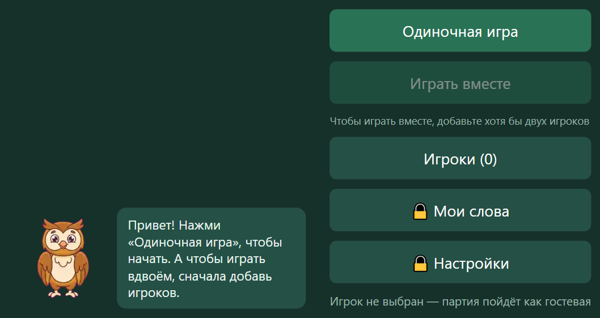

| Кнопка | Что делает |
|---|---|
| **Одиночная игра** | Партия без выбора игрока — быстро показать программу |
| **Играть вместе** | Партия для отмеченных игроков, по очереди |
| **Игроки** | Завести детей и отметить, кто сегодня играет |
| 🔒 **Мои слова** | Свои слова и комплекты (нужен пароль) |
| 🔒 **Настройки** | Громкость, устройство, уровни, цвет экрана, пароль |

Внизу написано, кто выбран. Пока никто не отмечен, там стоит «Игрок не выбран — партия пойдёт как гостевая»: играть можно, но результат никому не запишется.

Сова в углу — подсказчик: она коротко объясняет, что делать на текущем экране.

---

## 2. Игроки

При первом запуске список пуст.

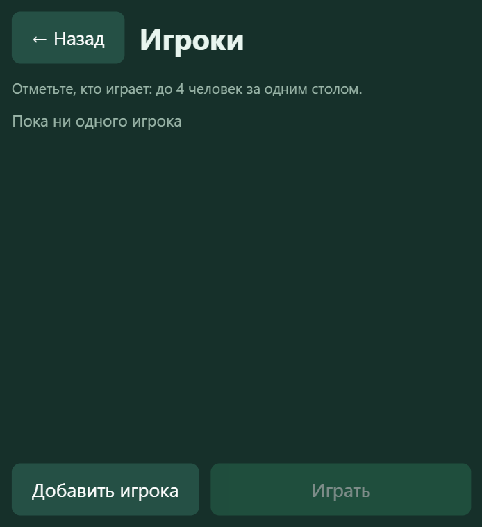

Нажмите «Добавить игрока». Имя набирается **экранной клавиатурой** — она работает и на сенсорной панели, где обычной клавиатуры нет.

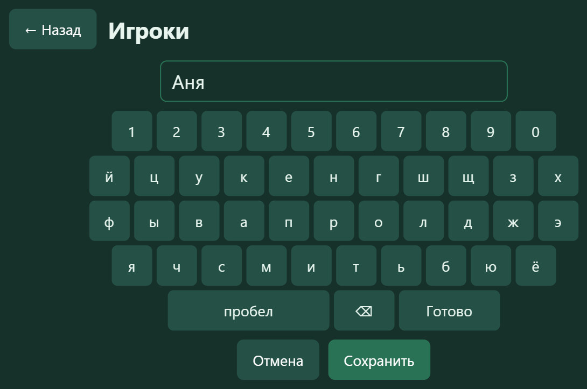

Заведите столько детей, сколько сядет за стол, — **до четырёх**. Затем отметьте тех, кто играет: галочка слева от имени.

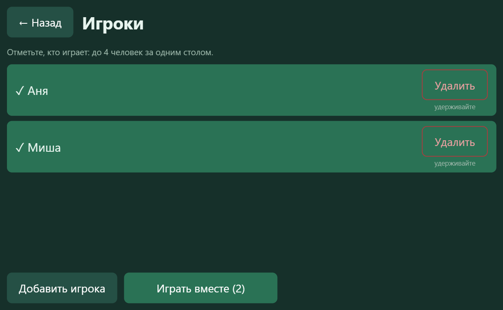

**Нажатие по имени — переключатель:** нажали ещё раз — отметка снимается.

**Удаление игрока — удержанием**, а не одним касанием: так ребёнок не сотрёт товарища случайным нажатием.

Когда все отмечены, нажмите «Играть».

---

## 3. Тема и рассадка

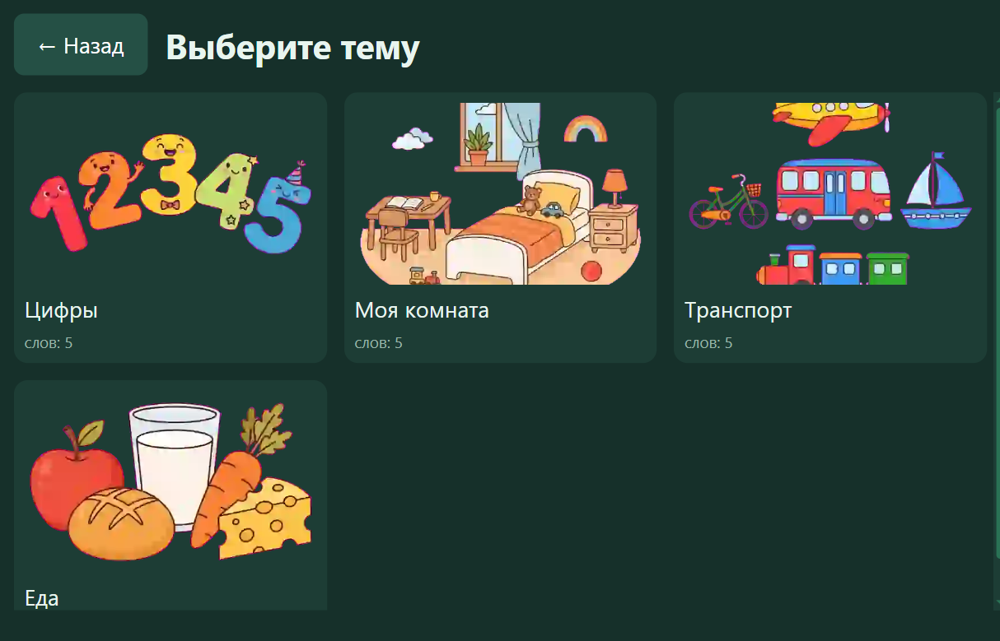

На карточке темы написано, сколько в ней слов, а если у темы уже есть награда — она показана здесь же.

Дальше программа предлагает **сесть по местам**.

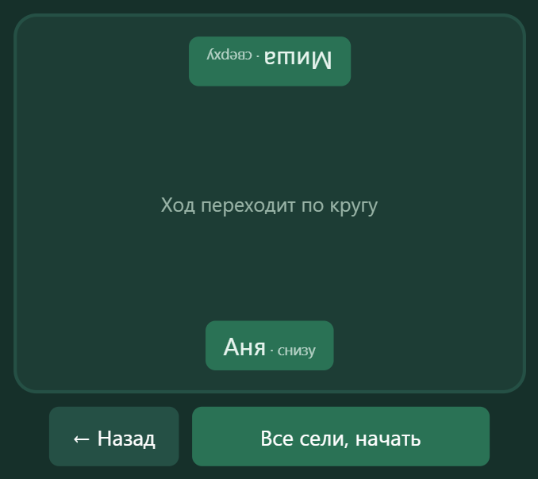

Здесь видно, кто с какой стороны стола. За интерактивным столом это важно: поле разворачивается к тому, чей ход, и ребёнок должен видеть его со своей стороны. Порядок хода — по кругу.

Перед началом программа показывает вводную к теме.

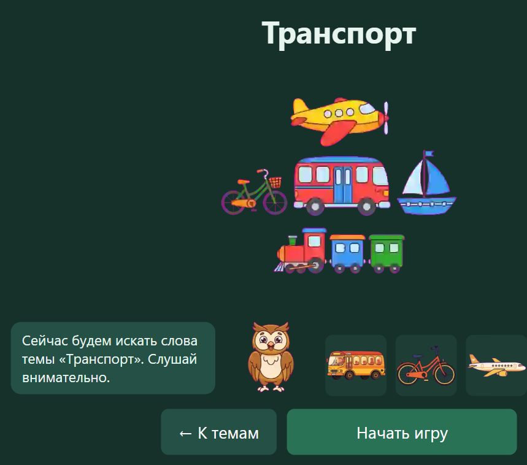

---

## 4. Ход занятия

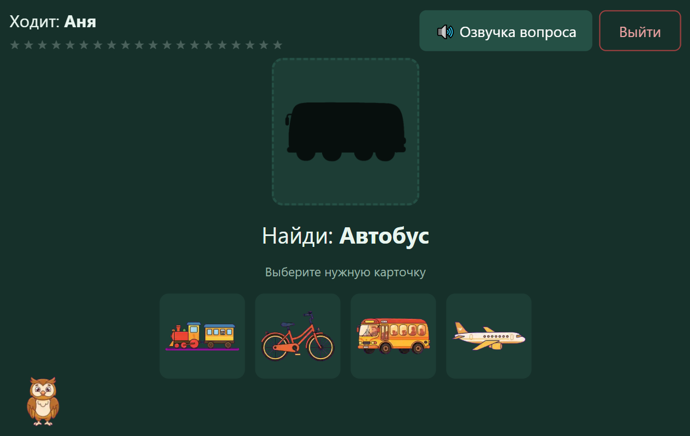

На экране:

- **вверху слева** — чей ход и звёздочки пройденных шагов;
- **в рамке** — силуэт загаданного предмета (на уровне Ⅰ);
- **под рамкой** — вопрос текстом: «Найди: Автобус»;
- **внизу** — карточки на выбор;
- **«Озвучка вопроса»** — произнести слово. Кнопка **не срабатывает сама**: это подсказка по вашему решению.

**Если ребёнок ошибся**, карточка убирается с экрана, а ход **остаётся за ним** — можно пробовать дальше. Шаг не закрывается и не засчитывается как неудача.

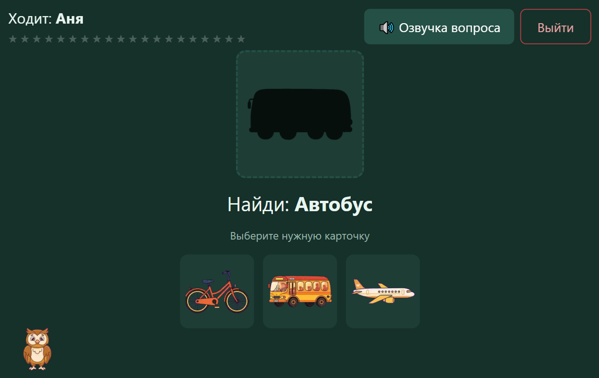

После верного ответа силуэт проявляется в картинку, и ход переходит следующему ребёнку.

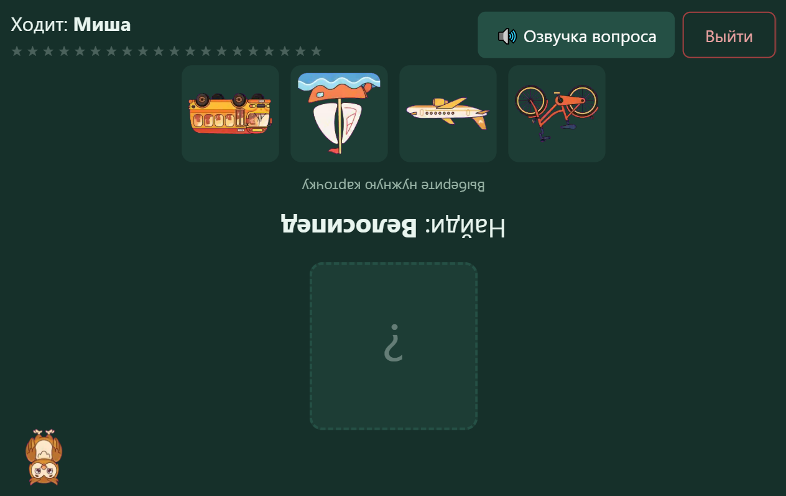

> **В совместной игре дети не получают одно и то же задание.** В пределах круга слова у всех разные, и одному ребёнку одно слово не выпадает двумя его шагами подряд.

**Повторное касание уже убранной карточки и ответ после конца партии игнорируются** и ошибкой не считаются: на сенсорной панели двойное касание — обычное дело, и штрафовать за него ребёнка нельзя.

Кнопка «Выйти» завершает партию досрочно.

---

## 5. Итоги и награды

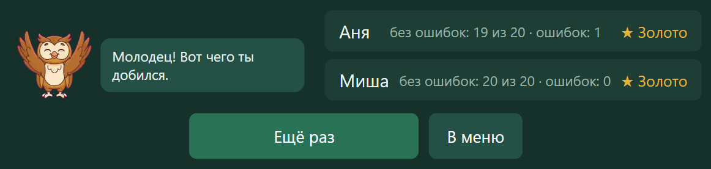

По каждому ребёнку: сколько шагов пройдено **без ошибок** из общего числа и сколько было ошибок. Рядом — награда за тему.

Награда **только улучшается**: неудачный заход в конце дня не отнимет заработанное золото.

---

## 6. Разделы педагога и пароль

«Мои слова» и «Настройки» закрыты паролем, чтобы ребёнок не изменил их случайно.

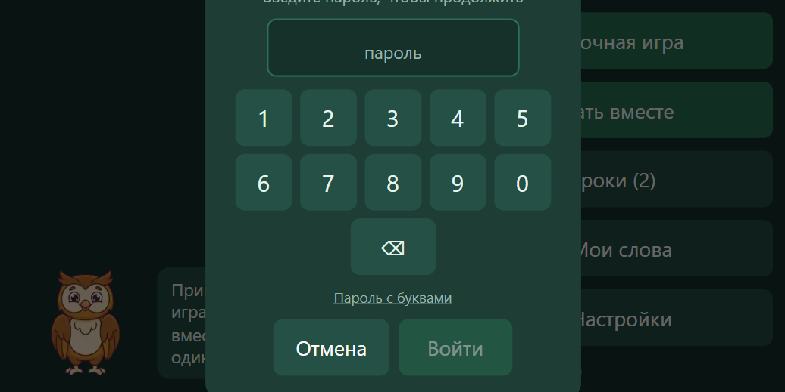

**Пароль по умолчанию — `12345`.** Наберите его и нажмите «Готово».

Кнопка переключения показывает буквенную клавиатуру: пароль может быть и словом. **Смените пароль перед началом работы в группе** — стоящий по умолчанию известен всем, у кого есть эта инструкция.

Пароль этой программы **не совпадает** с паролями других программ комплекта.

---

## 7. Настройки и уровни

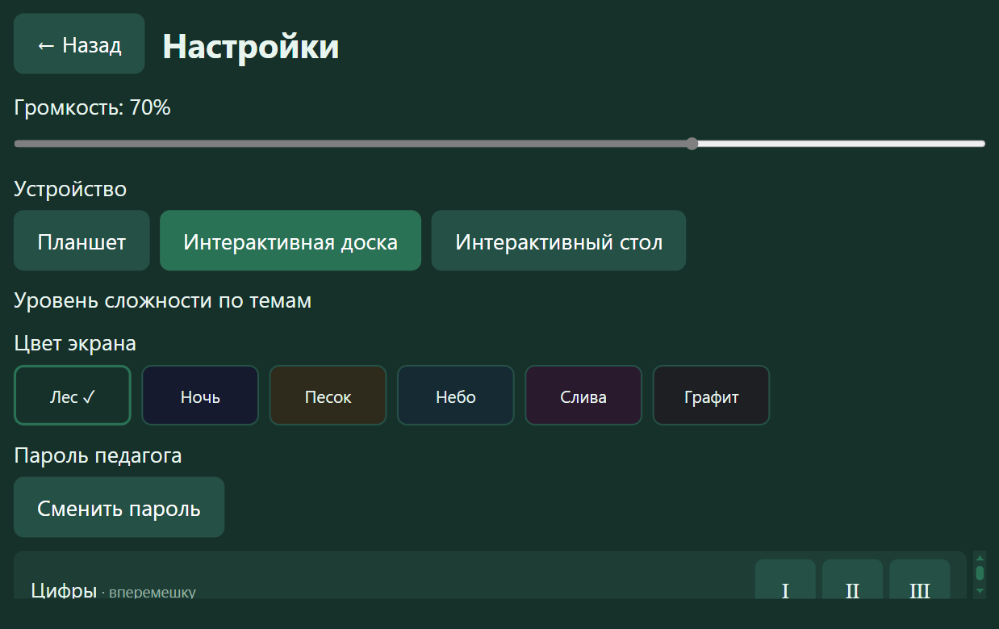

- **Громкость** — общая громкость озвучки.
- **Устройство** — планшет, интерактивная доска или стол. От этого зависит поведение поля при игре нескольких детей.
- **Цвет экрана** — шесть вариантов. Тёмные («Ночь», «Графит») удобны в затемнённом зале, светлые — при ярком свете.
- **Пароль педагога** — сменить пароль.
- **Уровень сложности по темам** — для каждой темы свой: Ⅰ, Ⅱ или Ⅲ.

### Чем различаются уровни

| Уровень | Что видит ребёнок |
|---|---|
| **Ⅰ** | Силуэт предмета показан — можно сопоставить по форме. Самый простой вход |
| **Ⅱ** | Силуэта нет: опора только на вопрос |
| **Ⅲ** | Отличается от Ⅱ только сценарием озвучки |

**Честное предупреждение:** перетаскивание карточки, которое раньше отличало уровень Ⅲ, убрано по решению заказчика, и сейчас уровни Ⅱ и Ⅲ для ребёнка почти одинаковы. Если нужно более заметное различие, это решается отдельно.

---

## 8. Свои слова и комплекты

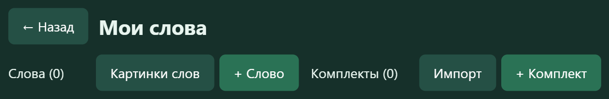

Здесь заводятся собственные слова и собираются комплекты под конкретное занятие.

### Своё слово

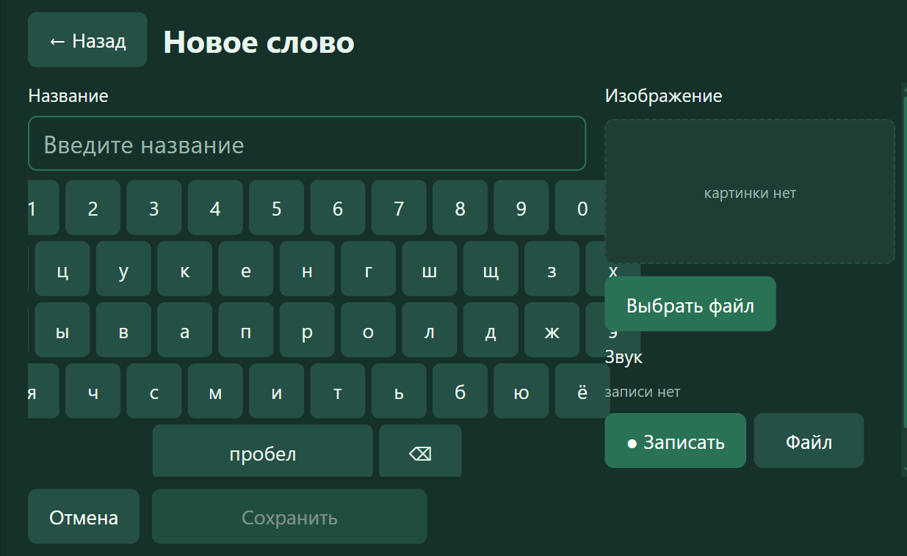

1. Наберите название экранной клавиатурой.
2. **Изображение** — «Выбрать файл». Принимаются PNG, JPEG, GIF, WebP и SVG. Файл проверяется по содержимому, а не по расширению: переименованная программа под видом картинки не пройдёт.
3. **Звук** — «Записать» (запись голосом с микрофона) или «Файл» (готовая запись).
4. «Сохранить» становится доступной, когда слово готово.

Записанное вашим голосом слово звучит в игре так же, как поставочное.

### Комплекты

Комплект — это набор слов под занятие: в него берутся и поставочные слова, и ваши. С комплектами можно делать пять вещей: создать, переименовать, удалить, **выгрузить в файл** и **загрузить из файла**.

Выгруженный файл переносится на другой компьютер. Вместе со словами едут картинки и записи. После загрузки программа сообщает, сколько слов пришло, и **предупреждает, если комплект приехал не целиком**, — лучше узнать об этом сразу, чем на занятии.

---

## 9. Если что-то пошло не так

| Что видите | Что это значит |
|---|---|
| «Игрок не выбран — партия пойдёт как гостевая» | Никто не отмечен. Результат не запишется; отметьте ребёнка в разделе «Игроки» |
| Кнопка «Играть» не нажимается | Не отмечен ни один игрок |
| Карточка не откликается | Она уже отвергнута на этом шаге — это не сбой |
| Слово не звучит | У него нет записи. Для своего слова — запишите её в редакторе |
| Картинка не появилась | Сообщите администратору: вероятно, набор контента установлен не полностью |
| Забыт пароль педагога | Сбрасывается администратором — см. инструкцию администратора |

Ошибка всегда показывается **текстом с объяснением** и не приводит к потере уже сохранённого. Данные игроков и ваш контент сохраняются между запусками; прерывание записи (выключили питание) не портит уже сохранённое.

---

## Чего в программе нет

Стоит знать заранее, чтобы не искать:

- **автоматического обновления** — новая версия устанавливается администратором;
- **одновременной игры вчетвером**: за столом играют **по очереди**, поле разворачивается к тому, чей ход;
- **работы через интернет** — программа автономна, и это сделано намеренно.

---

**Дополнительно:** технические подробности (где лежат данные, как делать резервную копию, как сбросить пароль) — в «Инструкции администратора» `words-admin-guide.md`.
